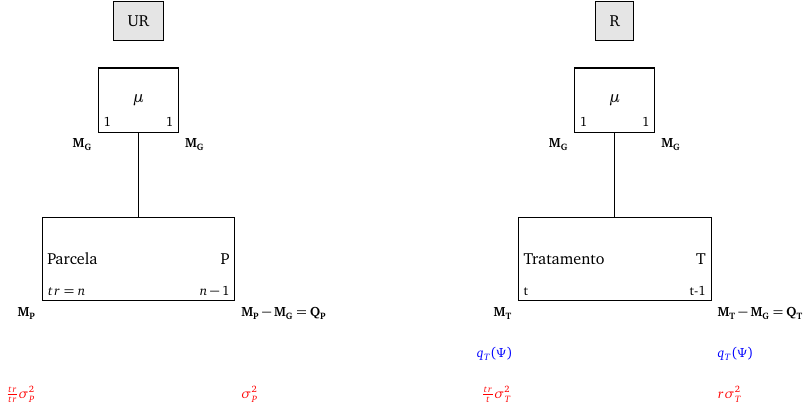
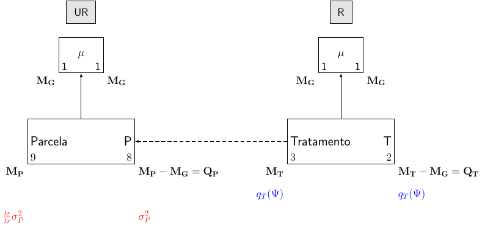
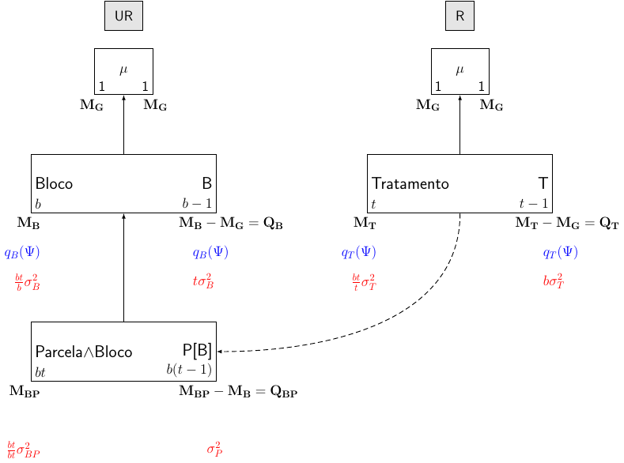
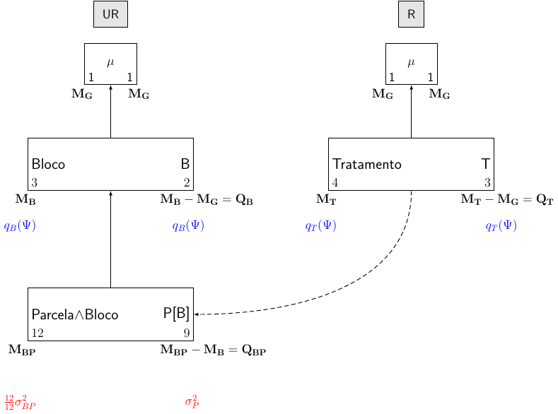
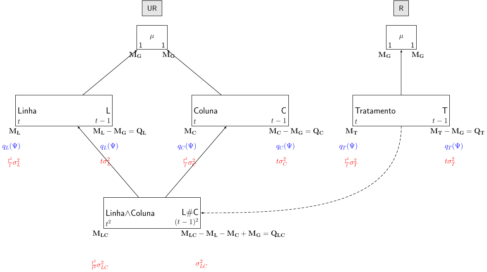
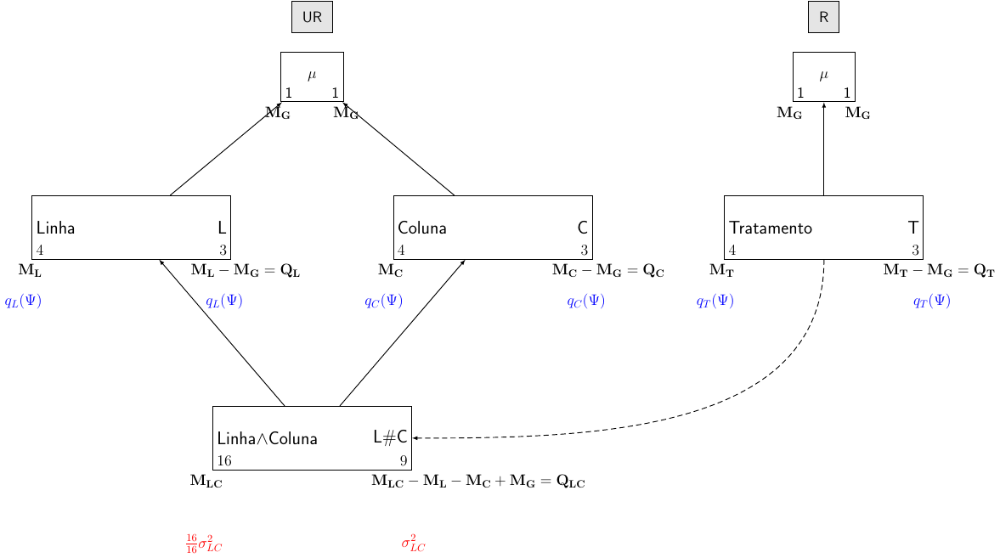
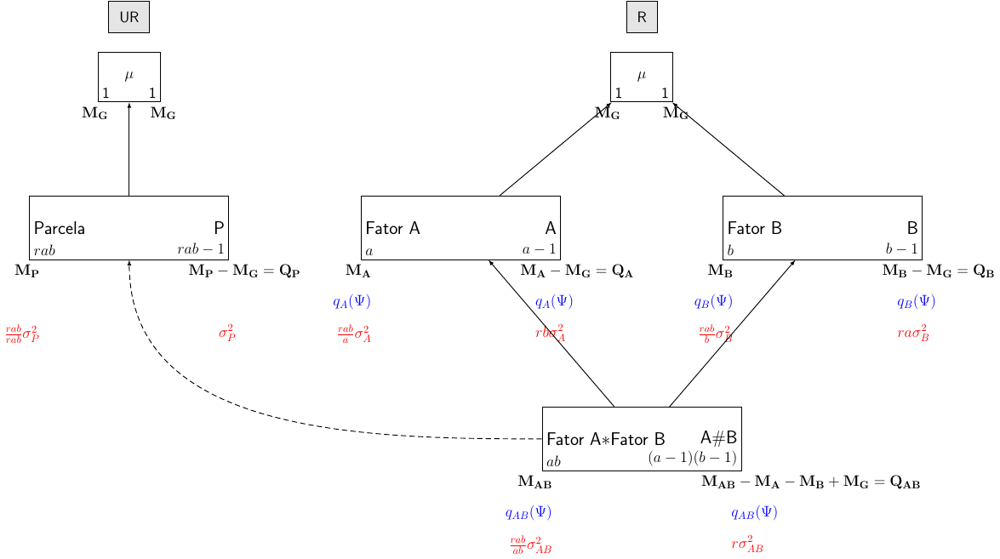

```{r setup, include=FALSE}
library(knitr, quietly = TRUE)
opts_chunk$set(
               cache = TRUE,
               tidy = FALSE,
               comment = "#",
               collapse = TRUE,
               fig.align = "center",
               fig.path = "figures/",
               cache.path = "cache/"
           )
```

# Objetivo

Determinação do modelo e da tabela de análise de variância para
experimentos planejados em qualquer tipo de delineamento.

# Procedimentos gerais

O procedimento consiste de 7 passos:

1. Descrição das características pertinentes ao estudo
2. Estrutura experimental
3. Fontes de variação, obtidas através da fórmula estrutural
4. Número de graus de liberdade e somas de quadrados
5. Tabela de análise de variância
6. Modelos de esperança e de variância (maximais)
7. Esperanças dos quadrados médios

## 1. Descrição das características pertinentes ao estudo

Consiste em identificar:

1. Unidade observacional: entidade física medida
2. Variável resposta: variávelde intersse
3. Fatores não casualizados (**unrandomized**): aqueles que indexariam
as unidades observacionais se nenhuma casualização fosse empregada
4. Fatores casualizados (**randomized**): aqueles associados às unidades
observacionais como resultado da casualização
5. Tipo de estudo: delineamento experimental associado ao esquema de
tratamento ou método de amostragem

**Observação**: Para determinar se um fator é **randomized** ou
**unrandomized**, deve-se fazer a seguinte pergunta:

- Para uma unidade observacional os níveis do fator podem ser
identificados se a casualização ainda não foi realizada?
    - Se **sim**, então o fator é **unrandomized**
    - Se **não**, então o fator é **randomized**

## 2. Estrutura experimental

Para determinar a estrutura experimental:

1. Descrever a relação de cruzamento ou aninhamento entre os fatores
   **unrandomized** no experimento
2. Descrever a relação de cruzamento ou aninhamento entre:
    a. os fatores **randomized**
    b. os fatores **randomized** e **unrandomized** (se houver)
3. Acrescentar o número de níveis dos fatores em frente aos nomes

Simbologia:

| Fatores | Símbolo |
|---------|---------|
| Cruzados | $A * B$ |
| Aninhados | $A/B$ |

**Fórmula estrutural**

Exemplo para DBC com $b$ blocos, $k$ parcelas e $t$ tratamentos:

| Estrutura | Fórmula |
|-----------|---------|
| Unrandomized | $b$ blocos/$k$ parcelas |
| Randomized | $t$ tratamentos |

Exemplo para DQL com $k$ linhas e colunas, e $t$ tratamentos:

| Estrutura | Fórmula |
|-----------|---------|
| Unrandomized | $k$ linhas $*$ $k$ colunas |
| Randomized | $t$ tratamentos |

## 3. Fontes de variação obtidas através da fórmula estrutural

Regras para expandir a fórmula estrutural:

$$
A*B = A + B + A\#B
$$

$$
A/B = A + B[fg(A)]
$$

Onde $fg(A)$ é chamado de **fator generalizado**. Um fator generalizado
é formado a partir de vários fatores originais, cujos níveis são
combinações dos níveis dos fatores originais. Sua representação é uma
lista dos fatores constituintes, separados por "$\wedge$".

Exemplo para DBC:

$$
\textrm{Blocos}/\textrm{Parcelas} = \textrm{Blocos} +
\textrm{Parcelas[Blocos]}
$$

Exemplo para DQL:

$$
\textrm{Linhas}*\textrm{Colunas} = \textrm{Linhas} + \textrm{Colunas} +
\textrm{Linhas # Colunas}
$$

## 4. Número de graus de liberdade e somas de quadrados

O Diagrama de Hasse é uma representação de marginalidade entre os
componentes envolvidos.

**Marginalidade:** Um fator generalizado $V$ é marginal a outro fator
generalizado $Z$, se os fatores de $V$ são um subconjunto de $Z$.
Notação: $V \leq Z$.

**Diagrama de Hasse:** o diagrama de Hasse para os fatores generalizados
de uma fórmula estrutural é formado tal que, a posição das "caixas"
representando tais fatores generalizados indique a **relação entre os
fatores** presentes em cada fórmula estrutural:

- Um fator generalizado (FG) deve estar acima do FG para o qual o
  primeiro é marginal
- Se dois FGs são **cruzados**, devem estar na mesma linha
- Acima de todos os FGs, coloca-se a média universal $\mu$
- À esquerda, escreve-se o FG e o número de níveis. À direita,
  escreve-se o número de graus de liberdade e a fonte da variação
- Os graus de liberdade são obtidos pela diferença entre o número de
  níveis do FG e a soma dos graus de liberdade de todos os fatores
  marginais à ele ("acima" dele)

**Somas de quadrados:** são formas quadráticas do tipo $\mathbf{Y'QY}$.

A matriz $\mathbf{Q}$ pode ser expressa em função das matrizes de
projeção $\mathbf{M}$,
$$
\mathbf{M} = \mathbf{X(X'X)^{-1}X'}
$$
Onde $\mathbf{X}$ é a matriz de incidência, de **posto completo**.

Portanto, $\mathbf{Q}$ é a diferença algébrica de matrizes $\mathbf{M}$.

Exemplo para DBC:

$$
\begin{align}
\textrm{SQB} &= \mathbf{Y'Q_{B}Y} \\
\textrm{SQP[B]} &= \mathbf{Y'Q_{BP}Y} \\
\textrm{SQTrat} &= \mathbf{Y'Q_{T}Y} \\
\textrm{SQRes} &= \mathbf{Y'Q_{Res}Y}
\end{align}
$$

Onde:

$$
\begin{align}
\mathbf{Q_B} &= \mathbf{M_B - M_G} \\
\mathbf{Q_{BP}} &= \mathbf{M_{BP} - M_G} \\
\mathbf{Q_T} &= \mathbf{M_T - M_G} \\
\mathbf{Q_{Res}} &= \mathbf{M_{BP} - M_{B} - M_{T} + M_G}
\end{align}
$$

## 5. Tabela de análise de variância

1. Listar todas as fontes **unrandomized**
2. Alocar as fontes **randomized** sob as fontes unrandomized com as
   quais estão confundidas (**identadas**)
3. Adicionar fontes residuais às porções restantes das fontes
   **unrandomized**

Exemplo para DBC:


| Fonte de variação | GL           | SQ                    |
|-------------------|--------------|-----------------------|
| Blocos            | $b-1$        | $\mathbf{Y'Q_{B}Y}$   |
| Parcelas[Blocos]  | $b(t-1)$     | $\mathbf{Y'Q_{BP}Y}$  |
|     Tratamentos   | $t-1$        | $\mathbf{Y'Q_{T}Y}$   |
|     Resíduo       | $(b-1)(t-1)$ | $\mathbf{Y'Q_{Res}Y}$ |


## 6. Modelos de esperança e variância

1. Designar cada fator original como **fixo** ou **aleatório**
2. Determinar se um fator generalizado (FG) é potencialmente de
   esperança ou de variância:
    a. fator generalizado de efeito fixo: **esperança**
    b. pelo menos um fator generalizado de efeito aleatório: **termo de
   variação**
    c. termo consistindo de todos os fatores não casualizados é
   considerado aleatório
3. O **modelo de esperança maximal** ($\boldsymbol{\Psi}$) dá-se pela
   soma dos termos de esperança
4. O **modelo de variação maximal** dá-se pela soma de todos os termos de
   variação

**Efeito aleatório**:

- Grande número de níveis na população
- Comportamento aleatório
- Seus níveis podem ser descritos por uma distribuição de probabilidade

**Efeito fixo**:

- Número pequeno ou grande de níveis
- Comportamento sistemático
- Não podem ser descritos por uma distribuição de probabilidade

**Exemplo para DBC:**

- Considerando todos os fatores de **efeito fixo**, o modelo maximal
usual é:
$$
y_{ij} = \mu + \beta_j + \tau_i + \epsilon_{ij}\, \qquad
j = 1, \ldots, b;\, i = 1, \ldots, t
$$
Assim:
$$
\begin{align}
\text{E}(Y_{ij}) &= \mu + \beta_i + \tau_i \\
\text{V}(Y_{ij}) &= \sigma^2_{BP} \\
\text{Cov}(Y_{ij}, Y_{i'j'}) &= 0 \,, \quad i \neq i', j \neq j'
\end{align}
$$
Matricialmente:
$$
\begin{align}
\boldsymbol{\Psi} = \text{E}(\mathbf{Y}) &=
\mathbf{X_G}\boldsymbol{\mu} + \mathbf{X_B}\boldsymbol{\beta} +
\mathbf{X_T}\boldsymbol{\tau} \\
\text{V}(\mathbf{Y}) &= \sigma^2_{BP} \mathbf{I_n}
\end{align}
$$
Simbolicamente:
$$
\begin{align}
\boldsymbol{\Psi} = \text{E}(\mathbf{Y}) &=
\textrm{Bloco} + \textrm{Tratamento} \\
\text{V}(\mathbf{Y}) &= \textrm{Bloco} \wedge \textrm{Parcela}
\end{align}
$$

- Considerando **bloco de efeito aleatório**, o modelo maximal usual é:
$$
y_{ij} = \mu + \beta_j + \tau_i + \epsilon_{ij}\, \qquad
j = 1, \ldots, b;\, i = 1, \ldots, t
$$
Assim:
$$
\begin{align}
\text{E}(Y_{ij}) &= \mu + \tau_i \\
\text{V}(Y_{ij}) &= \sigma^2_{BP} + \sigma^2_{B} \\
\text{Cov}(Y_{ij}, Y_{i'j}) &= \sigma^2_{B} \,, \quad i \neq i' \\
\text{Cov}(Y_{ij}, Y_{i'j'}) &= 0 \,, \quad j \neq j'
\end{align}
$$
Matricialmente:
$$
\begin{align}
\boldsymbol{\Psi} = \text{E}(\mathbf{Y}) &=
\mathbf{X_G}\boldsymbol{\mu} + \mathbf{X_T}\boldsymbol{\tau} \\
\text{V}(\mathbf{Y}) &= \sigma^2_{BP} \mathbf{I_n} +
\sigma^2_{B} (\mathbf{I_b} \otimes \mathbf{J_t})
\end{align}
$$
Simbolicamente:
$$
\begin{align}
\boldsymbol{\Psi} = \text{E}(\mathbf{Y}) &= \textrm{Tratamento} \\
\text{V}(\mathbf{Y}) &= \textrm{Bloco} +
\textrm{Bloco} \wedge \textrm{Parcela}
\end{align}
$$

## 7. Esperanças dos quadrados médios

1. Se $F$ é um termo no **modelo de variação**, atribuir
   $\frac{n}{f}\sigma^2_F$, onde $n$ é o número de unidades
   experimentais, e $f$ é o número de níveis de $F$. Se $F$ é um termo
   no **modelo de esperança**, atribuir $q_F(\Psi)$
    - Do lado direito de cada FG, somar as contribuições para a
      esperança do quadrado médio, $\textrm{E}[QM]$
    - **Esse procedimento é o único que é realizado de baixo para cima
      no diagrama de Hasse**
2. Adicionar as contribuições dos fatores **unrandomized** na tabela
3. Repetir o passo (2) e somar as contribuições àquelas que já estão na
   tabela

Exemplo para DBC:

| Fonte de variação | E[QM] (Fixo)                | E[QM] (Bloco Aleat.)         |
|-------------------|-----------------------------|------------------------------|
| Blocos            | $\sigma^2_{BP} + q_B(\Psi)$ | $\sigma^2_{BP} + \sigma^2_B$ |
| Parcelas[Blocos]  |                             |                              |
|     Tratamentos   | $\sigma^2_{BP} + q_T(\Psi)$ | $\sigma^2_{BP} + q_T(\Psi)$  |
|     Resíduo       | $\sigma^2_{BP}$             | $\sigma^2_{BP}$              |

**Nota sobre $E[QM]$**:

Na tabela de análise de variância, temos um valor F, que é a razão de
dois quadrados médios. Por que isso é apropriado? Para responder essa
pergunta devemos olhar para o que os dois quadrados médios medem, e isso
é feito através dos valores esperados dos quadrados médios.

A esperança do quadrado médio são os valores médios dos quadrados médios
na população que é descrita pelo modelo considerado, ou seja, um
quadrado médio esperado é o verdadeiro valor na população. Isto é
análogo à dizer que o valor esperado de uma observação na opulação é sua
média. Assim, se tivessemos a população completa para todos os
tratamentos, e calculassemos os quadrados médios destes dados completos,
então os valores seriam aqueles dados pela tabela.

Note que os valores médios na população envolvem $\sigma^2$, a variação
devido ao acaso (não controlada) entre as unidades do mesmo tratamento.
No entanto, esse valor médio também depende de uma quantidade
$q_F(\Psi)$ (onde $F$ é um fator qualquer).

Mas o que é $q_F(\Psi)$? Note que o subscrito $F$ denota que ele envolve
a matriz $Q_F$. Por exemplo, considere o termo pata tratamento,
$q_T(\Psi)$. De fato,

$$
\begin{align}
q_T(\Psi) &=
    \frac{\boldsymbol{\Psi}'\mathbf{Q_T}\boldsymbol{\Psi}}{(t-1)} \\
  &= \frac{\Sigma_{i=1}^{t} r_i (\tau_i - \bar\tau_{.})^2}{(t-1)}
\end{align}
$$

cujo denominador é o mesmo que uma soma de quadrados,
 exceto que é uma forma quadrática em $\boldsymbol{\Psi}$
 ao invés de $\mathbf{Y}$, onde

$$
\boldsymbol{\Psi} =
\begin{bmatrix}
E(Y_1) \\
E(Y_2) \\
\vdots \\
E(Y_n)
\end{bmatrix}
$$

Em todo caso, $q_T(\Psi)$ é uma forma quadrática e deve ser não negativa.
 De fato, a magnitude dessa quantidade vai depender do tamanho das diferenças
entre as médias de tratamento e a média geral. Se os efeitos forem próximos,
então serão parecidos com a média, enquanto que se forem mais espaçados haverá
maior distância de média. Consequentemente, a média de quadrado de tratamento
será (em média) maior do que e média de quadrado residual, pois é influenciada
tanto pela variação não controlada e a magnitude dos efeitos.

Portanto, $q_T(\Psi)$ só será zero quando os efeitos de tratamento forem
iguais, ou seja, quando a hipótese nula for verdadeira. Dessa forma,
os quadrados médios serão parecidos e o valor de F será próximo de 1. Assim,
as seguintes hipóteses são equivalentes:

$$
\begin{align}
H_0 &: q_T(\Psi) = 0 \\
H_0 &: \tau_i = \tau_2 = \ldots = \tau_t
\end{align}
$$

# Principais delineamentos

## Delineamento inteiramente casualizado (DIC)

Considere um experimento em um delineamento inteiramente casualizado com
$t$ tratamentos e $r$ repetições.

O modelo associado à este delineamento é

$$
y_{ij} = \mu + \tau_i + \epsilon_{ij}\, \qquad i = 1, \ldots, t;\, j = 1,
\ldots, r
$$

Matricialmente o modelo pode ser escrito como:

$$
\begin{align}
\mathbf{Y} &= \mathbf{X}\boldsymbol{\theta} +
\boldsymbol{\epsilon} \\
\mathbf{Y} &= \mathbf{X_G}\boldsymbol{\mu} +
\mathbf{X_T}\boldsymbol{\tau} +
\boldsymbol{\epsilon}
\end{align}
$$

- Fórmula estrutural

| Estrutura | Fórmula |
|-----------|---------|
| Unrandomized | $tr$ parcelas |
| Randomized | $t$ tratamentos |

- Diagrama de Hasse

```{r, echo=FALSE, out.width='100%'}

```


- Tabela de ANOVA

| Fonte de variação | GL       | SQ                    | QM                                   | E[QM] (Fixo)             | E[QM] (Aleat.)              |
|-------------------|----------|-----------------------|--------------------------------------|--------------------------|-----------------------------|
| Parcelas          | $tr-1$   | $\mathbf{Y'Q_PY}$     |                                      |                          |                             |
|     Tratamentos   | $t-1$    | $\mathbf{Y'Q_TY}$     | $\frac{\mathbf{Y'Q_TY}}{t-1}$        | $\sigma^2_P + q_T(\Psi)$ | $\sigma^2_P + r \sigma^2_T$ |
|     Resíduo       | $t(r-1)$ | $\mathbf{Y'Q_{Res}Y}$ | $\frac{\mathbf{Y'Q_{Res}Y}}{t(r-1)}$ | $\sigma^2_P$             | $\sigma^2_P$                |

Onde:

$$
\begin{align}
\mathbf{Q_P} &= \mathbf{M_P - M_G} \\
\mathbf{Q_{T}} &= \mathbf{M_{T} - M_G} \\
\mathbf{Q_{Res}} &= \mathbf{Q_P - Q_T} \\
                 &= \mathbf{M_P - M_G - (M_T - M_G)} \\
                 &= \mathbf{M_P - M_T}
\end{align}
$$

E:

$$
\begin{align}
\mathbf{M_G} &= \mathbf{X_G(X'_G X_G)^{-1}X'_G} \\
\mathbf{M_P} &= \mathbf{X_P(X'_P X_P)^{-1}X'_P} \\
\mathbf{M_T} &= \mathbf{X_T(X'_T X_T)^{-1}X'_T}
\end{align}
$$

- Hipóteses e teste $F$

|            | Fixo                 | Aleatório             |
|------------|----------------------|-----------------------|
| Tratamento | $H_0: q_T(\Psi) = 0$ | $H_0: \sigma^2_T = 0$ |

Testes:

$$
F_T = \frac{\textrm{QMT}}{\textrm{QMRes}}
$$

- Exemplo no R

Os dados apresentados a seguir referem-se à produções (kg/m$^2$) de 3
variedades de soja obtidas de um experimento instalado segundo o
delineamento inteiramente casualizado (DIC) com 3 repetições. Aqui
considera-se tratamento como de **efeito fixo**.

```{r, collapse=TRUE}
## Dados
da.dic <- data.frame(variedade = rep(c("V1", "V2", "V3"), each = 3),
                     parcela = factor(1:9),
                     producao = c(41, 40, 44,
                         51, 48, 50,
                         53, 54, 52))
## Estrutura dos dados
str(da.dic)
## Croqui do experimento
set.seed(11)
matrix(sample(da.dic$variedade), ncol = 3)
```

A **fórmula estrutural** é:

| Estrutura | Fórmula |
|-----------|---------|
| Unrandomized | $9$ parcelas |
| Randomized | $3$ tratamentos |

O **diagrama de Hasse** fica desta forma:

```{r, echo=FALSE, out.width='100%'}

```

A **tabela de ANOVA** fica:

| Fonte de variação | GL       | SQ                    | QM                                   | E[QM] (Fixo)             |
|-------------------|----------|-----------------------|--------------------------------------|--------------------------|
| Parcelas          | $8$   | $\mathbf{Y'Q_PY}$     |                                      |                          |
|     ¬¬Tratamentos | $2$    | $\mathbf{Y'Q_TY}$     | $\frac{\mathbf{Y'Q_TY}}{t-1}$        | $\sigma^2_P + q_T(\Psi)$ |
|     ¬¬Resíduo     | $6$ | $\mathbf{Y'Q_{Res}Y}$ | $\frac{\mathbf{Y'Q_{Res}Y}}{t(r-1)}$ | $\sigma^2_P$             |


Calculando as matrizes $\mathbf{Q}$ manualmente:

```{r, collapse=TRUE}
##----------------------------------------------------------------------
## Atribui nomes comuns para variável resposta e tratamento
var.resp <- da.dic$producao
tratamento <- da.dic$variedade
parcela <- da.dic$parcela
##----------------------------------------------------------------------
## Definições
(t <- length(unique(tratamento)))
(r <- unique(table(tratamento)))
(n <- length(var.resp)) # t*r para o caso balanceado
##----------------------------------------------------------------------
## Matrizes
## Vetor de respostas
(Y <- matrix(var.resp, ncol = 1))
## Matriz de médias
(Xg <- matrix(rep(1, n), ncol = 1))
## Matriz de tratamentos
Xt <- matrix(0, nrow = n, ncol = t)
Xt[cbind(seq_along(tratamento), tratamento)] <- 1; Xt
## Matriz de parcelas (identidade)
(Xp <- diag(1, nrow = n))
##----------------------------------------------------------------------
## Matrizes M
## para média
Mg <- Xg %*% solve(t(Xg) %*% Xg) %*% t(Xg)
MASS::fractions(Mg)
## para tratamento
Mt <- Xt %*% solve(t(Xt) %*% Xt) %*% t(Xt)
MASS::fractions(Mt)
## para parcela
Mp <- Xp %*% solve(t(Xp) %*% Xp) %*% t(Xp)
MASS::fractions(Mp)
##----------------------------------------------------------------------
## Matrizes de projeção ortogonal
## para parcela
Qp <- Mp - Mg
MASS::fractions(Qp)
## para tratamento
Qt <- Mt - Mg
MASS::fractions(Qt)
## para resíduos
Qr <- Mp - Mt
MASS::fractions(Qr)
##----------------------------------------------------------------------
## Graus de liberdade (usando propriedade de traço)
(GLp <- sum(diag(Qp))) # n - 1
(GLt <- sum(diag(Qt))) # t - 1
(GLr <- sum(diag(Qr))) # n - t
##----------------------------------------------------------------------
## Soma de quadrados
(SQp <- t(Y) %*% Qp %*% Y)
(SQt <- t(Y) %*% Qt %*% Y)
(SQr <- t(Y) %*% Qr %*% Y)
##----------------------------------------------------------------------
## Quadrado médio
(QMt <- SQt/GLt)
(QMr <- SQr/GLr)
##----------------------------------------------------------------------
## F calculado
(Fcalc <- QMt/QMr)
##----------------------------------------------------------------------
## p-valor
(p.valor <- pf(Fcalc, GLt, GLr, lower.tail = FALSE))
##----------------------------------------------------------------------
## Tabela final
tab.final <- data.frame("GL" = c(GLp, GLt, GLr),
                        "SQ" = c(SQp, SQt, SQr),
                        "QM" = c(NA, QMt, QMr),
                        "F"  = c(NA, Fcalc, NA),
                        "p-valor" = c(NA, p.valor, NA),
                        row.names = c("Parcela", "  Tratamento",
                                      "  Resíduo"))
tab.final
```

Compara os resultados usando a função `aov()`:

```{r, collapse=TRUE}
summary(aov(var.resp ~ tratamento))
## Usando a função Error() para indicar o confundimento
summary(aov(var.resp ~ tratamento + Error(parcela)))
```

```{r, include=FALSE}
## Usando fórmulas tradicionais
## SQTot
sum((var.resp - mean(var.resp))^2)
3*sum((tapply(var.resp, tratamento, mean) - mean(var.resp))^2)
```

## Delineamento em blocos completos (DBC)

Considere um experimento em um delineamento em blocos completos com
$t$ tratamentos e $b$ blocos.

O modelo associado à este delineamento é

$$
y_{ij} = \mu + \beta_i + \tau_j + \epsilon_{ij}\,
\qquad i = 1, \ldots,b;\, j = 1, \ldots, t
$$

Matricialmente o modelo pode ser escrito como:

$$
\begin{align}
\mathbf{Y} &= \mathbf{X}\boldsymbol{\theta} +
\boldsymbol{\epsilon} \\
\mathbf{Y} &= \mathbf{X_G}\boldsymbol{\mu} +
\mathbf{X_B}\boldsymbol{\beta} +
\mathbf{X_T}\boldsymbol{\tau} +
\boldsymbol{\epsilon}
\end{align}
$$

- Fórmula estrutural

| Estrutura | Fórmula |
|-----------|---------|
| Unrandomized | $b$ blocos/$t$ parcelas |
| Randomized | $t$ tratamentos |

- Diagrama de Hasse

```{r, echo=FALSE, out.width='100%'}

```

- Tabela de ANOVA

| Fonte de variação | GL           | SQ                    | QM                                       | E[QM] (1)                   | E[QM] (2)                       | E[QM] (3)                     | E[QM] (4)                       |
|-------------------|--------------|-----------------------|------------------------------------------|-----------------------------|---------------------------------|-------------------------------|---------------------------------|
| Blocos            | $b-1$        | $\mathbf{Y'Q_{B}Y}$   | $\frac{\mathbf{Y'Q_{B}Y}}{b-1}$          | $\sigma^2_{PB} + q_B(\Psi)$ | $\sigma^2_{PB} + t\sigma^2_{B}$ | $\sigma^2_{PB} + q_B(\Psi)$   | $\sigma^2_{PB} + t\sigma^2_{B}$ |
| Parcelas[Blocos]  | $b(t-1)$     | $\mathbf{Y'Q_{BP}Y}$  | $\frac{\mathbf{Y'Q_{BP}Y}}{b(t-1)}$      |                             |                                 |                               |                                 |
|     ¬¬Tratamentos | $t-1$        | $\mathbf{Y'Q_{T}Y}$   | $\frac{\mathbf{Y'Q_{T}Y}}{t-1}$          | $\sigma^2_{PB} + q_T(\Psi)$ | $\sigma^2_{PB} + q_T(\Psi)$     | $\sigma^2_{PB} + b\sigma^2_T$ | $\sigma^2_{PB} + b\sigma^2_{T}$ |
|     ¬¬Resíduo     | $(b-1)(t-1)$ | $\mathbf{Y'Q_{Res}Y}$ | $\frac{\mathbf{Y'Q_{Res}Y}}{(b-1)(t-1)}$ | $\sigma^2_{PB}$             | $\sigma^2_{PB}$                 | $\sigma^2_{PB}$               | $\sigma^2_{PB}$                 |

Onde os números após a E[QM] são as combinações:

- **(1)**: Bloco fixo, tratamento fixo
- **(2)**: Bloco aleatório, tratamento fixo
- **(3)**: Bloco fixo, tratamento aleatório
- **(4)**: Bloco aleatório, tratamento aleatório

E as matrizes são:

$$
\begin{align}
\mathbf{Q_B} &= \mathbf{M_B - M_G} \\
\mathbf{Q_{BP}} &= \mathbf{M_{BP} - M_B} \\
\mathbf{Q_{T}} &= \mathbf{M_{T} - M_G} \\
\mathbf{Q_{Res}} &= \mathbf{Q_{BP} - Q_T} \\
                 &= \mathbf{M_{BP} - M_B - (M_T - M_G)} \\
                 &= \mathbf{M_{BP} - M_B - M_T + M_G}
\end{align}
$$

E:

$$
\begin{align}
\mathbf{M_G} &= \mathbf{X_G(X'_G X_G)^{-1}X'_G} \\
\mathbf{M_B} &= \mathbf{X_B(X'_B X_B)^{-1}X'_B} \\
\mathbf{M_T} &= \mathbf{X_T(X'_T X_T)^{-1}X'_T} \\
\mathbf{M_{BP}} &= \mathbf{X_{BP}(X'_{BP} X_{BP})^{-1}X'_{BP}}
\end{align}
$$

- Hipóteses e teste $F$

|            | (1)                  | (2)                   | (3)                   | (4)                   |
|------------|----------------------|-----------------------|-----------------------|-----------------------|
| Bloco      | $H_0: q_B(\Psi) = 0$ | $H_0: \sigma^2_B = 0$ | $H_0: q_B(\Psi) = 0$  | $H_0: \sigma^2_B = 0$ |
| Tratamento | $H_0: q_T(\Psi) = 0$ | $H_0: q_T(\Psi) = 0$  | $H_0: \sigma^2_T = 0$ | $H_0: \sigma^2_T = 0$ |

Testes:

$$
\begin{align}
F_B &= \frac{\textrm{QMB}}{\textrm{QMRes}} \\
F_T &= \frac{\textrm{QMT}}{\textrm{QMRes}}
\end{align}
$$

(Para todos os casos).

- Exemplo no R

Os dados apresentados a seguir referem-se à produção média (2 plantas)
de frutos, em kg/planta, de uma espécie de laranjeira, enxertada sobre 4
clones (tratamento), obtidos de um experimento casualizado em blocos, e
considerando blocos e parcelas como de efeito fixo.

```{r, collapse=TRUE}
da.dbc <- data.frame(tratamento = rep(paste("T", 1:4, sep= ""), 3),
                     blocos = factor(rep(1:3, each = 4)),
                     producao = c(24.45, 80.55, 76.45, 54.6,
                                  21.85, 69.9, 64.2, 72.6,
                                  32.45, 52.85, 60.9, 55.25))
str(da.dbc)
## Croqui do experimento
set.seed(11)
croqui.DBC <- do.call(cbind, tapply(as.character(da.dbc$tratamento),
                                    da.dbc$bloco, sample))
dimnames(croqui.DBC) <- list(1:4, paste("Bloco", 1:3))
croqui.DBC
```

A **fórmula estrutural** fica:

| Estrutura | Fórmula |
|-----------|---------|
| Unrandomized | $3$ blocos/$4$ parcelas |
| Randomized | $4$ tratamentos |

E o **disgrama de Hasse** fica desta forma:

```{r, echo=FALSE, out.width='100%'}

```

Os cálculos feitos à mão no R:

```{r, collapse=TRUE}
##----------------------------------------------------------------------
## Atribui nomes comuns para variável resposta e tratamento
var.resp <- da.dbc$producao
tratamento <- da.dbc$tratamento
blocos <- da.dbc$blocos
##----------------------------------------------------------------------
## Definições
(t <- length(unique(tratamento)))
(b <- length(unique(blocos)))
(n <- t*b)
##----------------------------------------------------------------------
## Matrizes
## Vetor de respostas
(Y <- matrix(var.resp, ncol = 1))
## Matriz de médias
(Xg <- matrix(rep(1, n), ncol = 1))
## Matriz de tratamentos
Xt <- matrix(0, nrow = n, ncol = t)
Xt[cbind(seq_along(tratamento), tratamento)] <- 1; Xt
## Matriz de blocos
Xb <- matrix(0, nrow = n, ncol = b)
Xb[cbind(seq_along(blocos), blocos)] <- 1; Xb
## Matriz de blocos/parcelas (identidade)
(Xbp <- diag(1, nrow = n))
##----------------------------------------------------------------------
## Matrizes M
## para média
Mg <- Xg %*% solve(t(Xg) %*% Xg) %*% t(Xg)
MASS::fractions(Mg)
## para tratamento
Mt <- Xt %*% solve(t(Xt) %*% Xt) %*% t(Xt)
MASS::fractions(Mt)
## para blocos
Mb <- Xb %*% solve(t(Xb) %*% Xb) %*% t(Xb)
MASS::fractions(Mb)
## para bloco/parcela
Mbp <- Xbp %*% solve(t(Xbp) %*% Xbp) %*% t(Xbp)
MASS::fractions(Mbp)
##----------------------------------------------------------------------
## Matrizes de projeção ortogonal
## para tratamento
Qt <- Mt - Mg
MASS::fractions(Qt)
## para bloco
Qb <- Mb - Mg
MASS::fractions(Qb)
## para bloco/parcela
Qbp <- Mbp - Mb
MASS::fractions(Qbp)
## para resíduos
Qr <- Mbp - Mt - Mb + Mg
MASS::fractions(Qr)
##----------------------------------------------------------------------
## Graus de liberdade (usando propriedade de traço)
(GLb <- sum(diag(Qb))) # b - 1
(GLbp <- sum(diag(Qbp))) # b * (t - 1)
(GLt <- sum(diag(Qt))) # t - 1
(GLr <- sum(diag(Qr))) # (b - 1) * (t - 1)
##----------------------------------------------------------------------
## Soma de quadrados
(SQb <- t(Y) %*% Qb %*% Y)
(SQbp <- t(Y) %*% Qbp %*% Y)
(SQt <- t(Y) %*% Qt %*% Y)
(SQr <- t(Y) %*% Qr %*% Y)
##----------------------------------------------------------------------
## Quadrado médio
(QMb <- SQb/GLb)
(QMt <- SQt/GLt)
(QMr <- SQr/GLr)
##----------------------------------------------------------------------
## F calculado
(Fcalc.b <- QMb/QMr)
(Fcalc.t <- QMt/QMr)
##----------------------------------------------------------------------
## p-valor
(p.valor.b <- pf(Fcalc.b, GLb, GLr, lower.tail = FALSE))
(p.valor.t <- pf(Fcalc.t, GLt, GLr, lower.tail = FALSE))
##----------------------------------------------------------------------
## Tabela final
tab.final <- data.frame("GL" = c(GLb, GLbp, GLt, GLr),
                        "SQ" = c(SQb, SQbp, SQt, SQr),
                        "QM" = c(QMb, NA, QMt, QMr),
                        "F"  = c(Fcalc.b, NA, Fcalc.t, NA),
                        "p-valor" = c(p.valor.b, NA, p.valor.t, NA),
                        row.names = c("Blocos", "Parcelas[Blocos]",
                                      "  Tratamentos", "  Resíduo"))
tab.final
```

Comparando os resultados com a função `aov()`:

```{r}
summary(aov(var.resp ~ blocos + tratamento))
## Usando a função Error() para identificar o confundimento
summary(aov(var.resp ~ blocos + tratamento + Error(blocos)))
```

## Delineamento em quadrado latino (DQL)

Considere um experimento em um delineamento em quadrado latino com
$t$ tratamentos, portanto com $t$ linhas e $t$ colunas.

O modelo associado à este delineamento é

$$
y_{ij} = \mu + \alpha_i + \beta_j + \gamma_{k(ij)} + \epsilon_{ij}\,
\qquad i = j = k = 1, \ldots, t
$$

Matricialmente o modelo pode ser escrito como:

$$
\begin{align}
\mathbf{Y} &= \mathbf{X}\boldsymbol{\theta} +
\boldsymbol{\epsilon} \\
\mathbf{Y} &= \mathbf{X_G}\boldsymbol{\mu} +
\mathbf{X_L}\boldsymbol{\alpha} +
\mathbf{X_C}\boldsymbol{\beta} +
\mathbf{X_{LC}}\boldsymbol{\gamma} +
\boldsymbol{\epsilon}
\end{align}
$$

- Fórmula estrutural

| Estrutura | Fórmula |
|-----------|---------|
| Unrandomized | $t$ linhas $*$ $t$ colunas |
| Randomized | $t$ tratamentos |

- Diagrama de Hasse

```{r, echo=FALSE, out.width='100%'}

```

- Tabela de ANOVA

| Fonte de variação | GL           | SQ                    | QM                                       | E[QM] (1)                   | E[QM] (2)                       | E[QM] (3)                     | E[QM] (4)                       |
|-------------------|--------------|-----------------------|------------------------------------------|-----------------------------|---------------------------------|-------------------------------|---------------------------------|
| Linha             | $t-1$        | $\mathbf{Y'Q_{L}Y}$   | $\frac{\mathbf{Y'Q_{L}Y}}{t-1}$          | $\sigma^2_{LC} + q_L(\Psi)$ | $\sigma^2_{LC} + q_L(\Psi)$     | $\sigma^2_{LC} + q_L(\Psi)$   | $\sigma^2_{LC} + t\sigma^2_{L}$ |
| Coluna            | $t-1$        | $\mathbf{Y'Q_{C}Y}$   | $\frac{\mathbf{Y'Q_{C}Y}}{t-1}$          | $\sigma^2_{LC} + q_C(\Psi)$ | $\sigma^2_{LC} + t\sigma^2_{C}$ | $\sigma^2_{LC} + q_C(\Psi)$   | $\sigma^2_{LC} + t\sigma^2_{C}$ |
| Linha#Coluna      | $(t-1)^2$    | $\mathbf{Y'Q_{LC}Y}$  | $\frac{\mathbf{Y'Q_{LC}Y}}{(t-1)^2}$     |                             |                                 |                               |                                 |
| ¬¬Tratamentos     | $t-1$        | $\mathbf{Y'Q_{T}Y}$   | $\frac{\mathbf{Y'Q_{T}Y}}{t-1}$          | $\sigma^2_{LC} + q_T(\Psi)$ | $\sigma^2_{LC} + q_T(\Psi)$     | $\sigma^2_{LC} + t\sigma^2_T$ | $\sigma^2_{LC} + t\sigma^2_{T}$ |
| ¬¬Resíduo         | $(t-1)(t-2)$ | $\mathbf{Y'Q_{Res}Y}$ | $\frac{\mathbf{Y'Q_{Res}Y}}{(t-1)(t-2)}$ | $\sigma^2_{LC}$             | $\sigma^2_{LC}$                 | $\sigma^2_{LC}$               | $\sigma^2_{LC}$                 |

Onde os números após a E[QM] são as combinações:

- **(1)**: Linha fixo, coluna fixo, tratamento fixo
- **(2)**: Linha fixo, coluna aleatório, tratamento fixo
- **(3)**: Linha fixo, coluna fixo, tratamento aleatório
- **(4)**: Linha aleatório, coluna aleatório, tratamento aleatório

E as matrizes são:

$$
\begin{align}
\mathbf{Q_L} &= \mathbf{M_L - M_G} \\
\mathbf{Q_C} &= \mathbf{M_C - M_G} \\
\mathbf{Q_{LC}} &= \mathbf{M_{LC} - M_L - M_C + M_G} \\
\mathbf{Q_{T}} &= \mathbf{M_{T} - M_G} \\
\mathbf{Q_{Res}} &= \mathbf{Q_{LC} - Q_T} \\
                 &= \mathbf{M_{LC} - M_L - M_C + M_G - (M_T - M_G)} \\
                 &= \mathbf{M_{LC} - M_L - M_C + M_G - M_T + M_G}
\end{align}
$$

E:

$$
\begin{align}
\mathbf{M_G} &= \mathbf{X_G(X'_G X_G)^{-1}X'_G} \\
\mathbf{M_L} &= \mathbf{X_L(X'_L X_L)^{-1}X'_L} \\
\mathbf{M_C} &= \mathbf{X_C(X'_C X_C)^{-1}X'_C} \\
\mathbf{M_T} &= \mathbf{X_T(X'_T X_T)^{-1}X'_T} \\
\mathbf{M_{LC}} &= \mathbf{X_{LC}(X'_{LC} X_{LC})^{-1}X'_{LC}}
\end{align}
$$

- Hipóteses e teste $F$

|            | (1)                  | (2)                   | (3)                   | (4)                   |
|------------|----------------------|-----------------------|-----------------------|-----------------------|
| Linha      | $H_0: q_L(\Psi) = 0$ | $H_0: q_L(\Psi) = 0$  | $H_0: q_L(\Psi) = 0$  | $H_0: \sigma^2_L = 0$ |
| Coluna     | $H_0: q_C(\Psi) = 0$ | $H_0: \sigma^2_C = 0$ | $H_0: q_C(\Psi) = 0$  | $H_0: \sigma^2_C = 0$ |
| Tratamento | $H_0: q_T(\Psi) = 0$ | $H_0: q_T(\Psi) = 0$  | $H_0: \sigma^2_T = 0$ | $H_0: \sigma^2_T = 0$ |

Testes:

$$
\begin{align}
F_L &= \frac{\textrm{QML}}{\textrm{QMRes}} \\
F_C &= \frac{\textrm{QMC}}{\textrm{QMRes}} \\
F_T &= \frac{\textrm{QMT}}{\textrm{QMRes}}
\end{align}
$$

(Para todos os casos).

- Exemplo no R

Os dados apresentados a seguir referem-se às produções de batata (kg/ha)
obtidas de um experimento instalado no delineamento em quadrado latino,
envolvendo quatro sistemas de plantio (S1, S2, S3, S4).

```{r, collapse=TRUE}
da.dql <- expand.grid(colunas = factor(1:4), linhas = factor(1:4))
da.dql$sistemas <- factor(c("S1", "S2", "S4", "S3",
                     "S4", "S1", "S3", "S2",
                     "S2", "S3", "S1", "S4",
                     "S3", "S4", "S2", "S1"))
da.dql$producao <- c(92.6, 96.3, 73.1, 86.7,
                     88.8, 100.3, 96.4, 97.2,
                     112.6, 100.1, 90.6, 65.7,
                     92.5, 43.7, 83.4, 70.2)
str(da.dql, give.attr = FALSE)
## Croqui do experimento
matrix(da.dql$sistemas, ncol = 4, byrow = TRUE)
```

A **fórmula estrutural** é:

| Estrutura | Fórmula |
|-----------|---------|
| Unrandomized | $4$ linhas $*$ $4$ colunas |
| Randomized | $4$ tratamentos |

E o **diagrama de Hasse** fica:

```{r, echo=FALSE, out.width='100%'}

```

A análise feita no R:

```{r, collapse=TRUE}
##----------------------------------------------------------------------
## Atribui nomes comuns para variável resposta, linhas e colunas
var.resp <- da.dql$producao
tratamento <- da.dql$sistemas
linhas <- da.dql$linhas
colunas <- da.dql$colunas
##----------------------------------------------------------------------
## Definicoes
t <- length(unique(tratamento))
n <- t^2
##----------------------------------------------------------------------
## Matrizes
## Vetor de respostas
(Y <- matrix(var.resp, ncol = 1))
## Matriz de médias
(Xg <- matrix(rep(1, n), ncol = 1))
## Matriz de tratamentos
Xt <- matrix(0, nrow = n, ncol = t)
Xt[cbind(seq_along(tratamento), tratamento)] <- 1; Xt
## Matriz de linhas
Xl <- matrix(0, nrow = n, ncol = t)
Xl[cbind(seq_along(linhas), linhas)] <- 1; Xl
## Matriz de colunas
Xc <- matrix(0, nrow = n, ncol = t)
Xc[cbind(seq_along(colunas), colunas)] <- 1; Xc
## Matriz de linhas#colunas (identidade)
(Xlc <- diag(1, nrow = n))
##----------------------------------------------------------------------
## Matrizes M
## para média
Mg <- Xg %*% solve(t(Xg) %*% Xg) %*% t(Xg)
MASS::fractions(Mg)
## para linhas
Ml <- Xl %*% solve(t(Xl) %*% Xl) %*% t(Xl)
MASS::fractions(Ml)
## para colunas
Mc <- Xc %*% solve(t(Xc) %*% Xc) %*% t(Xc)
MASS::fractions(Mc)
## para tratamentos
Mt <- Xt %*% solve(t(Xt) %*% Xt) %*% t(Xt)
MASS::fractions(Mt)
## para linha#coluna
Mlc <- Xlc %*% solve(t(Xlc) %*% Xlc) %*% t(Xlc)
MASS::fractions(Mlc)
##----------------------------------------------------------------------
## Matrizes de projeção ortogonal
## para linhas
Ql <- Ml - Mg
MASS::fractions(Ql)
## para colunas
Qc <- Mc - Mg
MASS::fractions(Qc)
## para linhas#colunas
Qlc <- Mlc - Ml - Mc + Mg
MASS::fractions(Qlc)
## para tratamentos
Qt <- Mt - Mg
MASS::fractions(Qt)
## para resíduo
Qres <- Mlc - Ml - Mc + Mg - Mt + Mg
MASS::fractions(Qres)
##----------------------------------------------------------------------
## Graus de liberdade (usando propriedade de traço)
(GLl <- sum(diag(Ql))) # t - 1
(GLc <- sum(diag(Qc))) # t - 1
(GLlc <- sum(diag(Qlc))) # (t - 1)^2
(GLt <- sum(diag(Qt))) # t - 1
(GLres <- sum(diag(Qres))) # (t - 1) * (t - 2)
##----------------------------------------------------------------------
## Soma de quadrados
(SQl <- t(Y) %*% Ql %*% Y)
(SQc <- t(Y) %*% Qc %*% Y)
(SQlc <- t(Y) %*% Qlc %*% Y)
(SQt <- t(Y) %*% Qt %*% Y)
(SQres <- t(Y) %*% Qres %*% Y)
## Quadrado médio
(QMl <- SQl/GLl)
(QMc <- SQc/GLc)
(QMt <- SQt/GLt)
(QMres <- SQres/GLres)
## F calculado
(Fcalc.l <- QMl/QMres)
(Fcalc.c <- QMc/QMres)
(Fcalc.t <- QMt/QMres)
## p-valor
(p.valor.l <- pf(Fcalc.l, GLl, GLres, lower.tail = FALSE))
(p.valor.c <- pf(Fcalc.c, GLc, GLres, lower.tail = FALSE))
(p.valor.t <- pf(Fcalc.t, GLt, GLres, lower.tail = FALSE))
## Tabela final
tab.final <- data.frame("GL" = c(GLl, GLc, GLlc, GLt, GLres),
                        "SQ" = c(SQl, SQc, SQlc, SQt, SQres),
                        "QM" = c(QMl, QMc, NA, QMt, QMres),
                        "F"  = c(Fcalc.l, Fcalc.c, NA, Fcalc.t, NA),
                        "p-valor" = c(p.valor.l, p.valor.c, NA, p.valor.t, NA),
                        row.names = c("Linhas", "Colunas", "Linhas#Colunas",
                                      "  Tratamentos", "  Resíduo"))
tab.final
```

Comparando os resultados com a função `aov()`:

```{r, collapse=TRUE}
summary(aov(var.resp ~ linhas + colunas + tratamento))
## Usando a função Error() para identificar o confundimento
summary(aov(var.resp ~ linhas + colunas + tratamento +
                Error(linhas*colunas)))
```

## Experimentos fatoriais

Os experimentos fatoriais são aqueles que consideram dois ou mais
fatores (tratamentos) em conjunto. Estes experimentos podem ser
realizados em diversos delineamentos, como inteiramente casualizado
(DIC), ou em blocos (DBC). Aqui veremos um exemplo de um experimento
no esquema fatorial com o delineamento inteiramente ao acaso.

Considere um experimento fatorial em um delineamento inteiramente
casualizado, supondo que o fator A possui $a$ níveis, o fator B possui
$b$ níveis, e ocorrem $r$ repetições de cada combinação dos fatores A e
B.

O modelo associado à este delineamento é

$$
y_{ijk} = \mu + \alpha_i + \beta_j + \gamma_{k(ij)} + \epsilon_{ijk}\,
\qquad i = 1, \ldots, a;\, j = 1, \ldots, b; k = 1, \ldots, r
$$

Matricialmente o modelo pode ser escrito como:

$$
\begin{align}
\mathbf{Y} &= \mathbf{X}\boldsymbol{\theta} +
\boldsymbol{\epsilon}_{ijk} \\
\mathbf{Y} &= \mathbf{X_G}\boldsymbol{\mu} +
\mathbf{X_A}\boldsymbol{\alpha} +
\mathbf{X_B}\boldsymbol{\beta} +
\mathbf{X_{AB}}\boldsymbol{\gamma} +
\boldsymbol{\epsilon}_{ijk}
\end{align}
$$

- Fórmula estrutural

| Estrutura | Fórmula |
|-----------|---------|
| Unrandomized | $n$ parcelas |
| Randomized | $a$ A $*$ $b$ B |

- Diagrama de Hasse

```{r, echo=FALSE, out.width='100%'}

```

- Tabela de ANOVA

| Fonte de variação | GL           | SQ                    | QM                                      | E[QM] (1)                     | E[QM] (2)                                      | E[QM] (3)                                      | E[QM] (4)                                      |
|-------------------|--------------|-----------------------|-----------------------------------------|-------------------------------|------------------------------------------------|------------------------------------------------|------------------------------------------------|
| Parcela           | $rab-1$      | $\mathbf{Y'Q_{P}Y}$   | $\frac{\mathbf{Y'Q_{P}Y}}{rab-1}$       |                               |                                                |                                                |                                                |
| A                 | $a-1$        | $\mathbf{Y'Q_{A}Y}$   | $\frac{\mathbf{Y'Q_{A}Y}}{a-1}$         | $\sigma^2_{P} + q_A(\Psi)$    | $\sigma^2_{P} + r\sigma^2_{AB} + rb\sigma^2_A$ | $\sigma^2_{P} + r\sigma^2_{AB} + q_A(\Psi)$    | $\sigma^2_{P} + r\sigma^2_{AB} + rb\sigma^2_A$ |
| B                 | $b-1$        | $\mathbf{Y'Q_{B}Y}$   | $\frac{\mathbf{Y'Q_{B}Y}}{b-1}$         | $\sigma^2_{P} + q_B(\Psi)$    | $\sigma^2_{P} + r\sigma^2_{AB} + q_B(\Psi)$    | $\sigma^2_{P} + r\sigma^2_{AB} + ra\sigma^2_B$ | $\sigma^2_{P} + r\sigma^2_{AB} + ra\sigma^2_B$ |
| A#B               | $(a-1)(b-1)$ | $\mathbf{Y'Q_{AB}Y}$  | $\frac{\mathbf{Y'Q_{AB}Y}}{(a-1)(b-1)}$ | $\sigma^2_{P} + q_{AB}(\Psi)$ | $\sigma^2_{P} + r\sigma^2_{AB}$                | $\sigma^2_{P} + r\sigma^2_{AB}$                | $\sigma^2_{P} + r\sigma^2_{AB}$                |
| Resíduo           | $ab(r-1)$    | $\mathbf{Y'Q_{Res}Y}$ | $\frac{\mathbf{Y'Q_{Res}Y}}{ab(r-1)}$   | $\sigma^2_{P}$                | $\sigma^2_{P}$                                 | $\sigma^2_{P}$                                 | $\sigma^2_{P}$                                 |

Onde os números após a E[QM] são as combinações:

- **(1)**: Fator A fixo, fator B fixo, A#B fixo
- **(2)**: Fator A aleatório, fator B fixo, A#B aleatório
- **(3)**: Fator A fixo, Fator B aleatório, A#B aleatório
- **(4)**: Fator A aleatório, fator B aleatório, A#B aleatório

**Observação:** A interação entre um fator de efeito fixo e um fator de
  efeito aleatório sempre será aleatória.

As matrizes são:

$$
\begin{align}
\mathbf{Q_P} &= \mathbf{M_P - M_G} \\
\mathbf{Q_A} &= \mathbf{M_A - M_G} \\
\mathbf{Q_B} &= \mathbf{M_B - M_G} \\
\mathbf{Q_{AB}} &= \mathbf{M_{AB} - M_A - M_B + M_G} \\
\mathbf{Q_{Res}} &= \mathbf{Q_{P} - Q_A - Q_B - Q_{AB}} \\
                 &= \mathbf{M_P - M_G - (M_A - M_G) - (M_B - M_G) -
                                (M_{AB} - M_A - M_B + M_G)} \\
                 &= \mathbf{M_P - M_{AB}}
\end{align}
$$

E:

$$
\begin{align}
\mathbf{M_G} &= \mathbf{X_G(X'_G X_G)^{-1}X'_G} \\
\mathbf{M_P} &= \mathbf{X_P(X'_P X_P)^{-1}X'_P} \\
\mathbf{M_A} &= \mathbf{X_A(X'_A X_A)^{-1}X'_A} \\
\mathbf{M_B} &= \mathbf{X_B(X'_B X_B)^{-1}X'_B} \\
\mathbf{M_{AB}} &= \mathbf{X_{AB}(X'_{AB} X_{AB})^{-1}X'_{AB}}
\end{align}
$$

- Hipóteses e teste $F$

|         | (1)                     | (2)                      | (3)                      | (4)                      |
|---------|-------------------------|--------------------------|--------------------------|--------------------------|
| FatorA | $H_0: q_A(\Psi) = 0$    | $H_0: \sigma^2_A = 0$    | $H_0: q_A(\Psi) = 0$     | $H_0: \sigma^2_A = 0$    |
| FatorB | $H_0: q_B(\Psi) = 0$    | $H_0: q_B(\Psi) = 0$     | $H_0: \sigma^2_B = 0$    | $H_0: \sigma^2_B = 0$    |
| A#B     | $H_0: q_{AB}(\Psi) = 0$ | $H_0: \sigma^2_{AB} = 0$ | $H_0: \sigma^2_{AB} = 0$ | $H_0: \sigma^2_{AB} = 0$ |

Testes:

Considerando apenas o caso (1), todos os fatores de **efeito fixo**:

$$
\begin{align}
F_A &= \frac{\textrm{QMA}}{\textrm{QMRes}} \\
F_B &= \frac{\textrm{QMB}}{\textrm{QMRes}} \\
F_{AB} &= \frac{\textrm{QMAB}}{\textrm{QMRes}}
\end{align}
$$

Considerando os casos (2), (3), e (4), onde pelo menos um dos fatores é
de **efeito aleatório**, e a interação é aleatória:

$$
\begin{align}
F_A &= \frac{\textrm{QMA}}{\textrm{QMAB}} \\
F_B &= \frac{\textrm{QMB}}{\textrm{QMAB}} \\
F_{AB} &= \frac{\textrm{QMAB}}{\textrm{QMRes}}
\end{align}
$$

- Exemplo no R:

Os dados apresentados a seguir referem-se às produções (kg/m$^2$) de
soja quando cultivadas sob diferentes tratamentos (adubo e torta). O
experimento foi instalado segundo o delineamento inteiramente
casualizado (DIC). **Importante**: ambos os tratamentos são considerados
como fixos.

```{r}
##----------------------------------------------------------------------
## Definições
a <- 2
b <- 2
r <- 4
n <- a * b * r
##----------------------------------------------------------------------
## Dados
# T0 = sem torta; T1 = com torta
# A0 = sem adubo; A1 = com adubo
da.fat <- data.frame(parcela = factor(1:n),
                     torta = rep(c("T0", "T1"), each = a*r),
                     adubo = rep(c("A0", "A1"), each = r, times = b),
                     tratamento = rep(c("Tr1", "Tr2", "Tr3", "Tr4"),
                                      each = a*b),
                     producao = c(28.2, 18.8, 19.6, 21.6,
                                  30.8, 31.2, 28.8, 30.8,
                                  29.8, 25.2, 24.8, 26,
                                  29.4, 29.8, 28.6, 30.4))
## Estrutura dos dados
str(da.fat)
##----------------------------------------------------------------------
## Croqui do experimento
## Sorteia aleatoriamente as variedades e dispõe em uma matriz 4x4
set.seed(11)
croqui.DIC.fat <- sample(paste(da.fat$adubo, da.fat$torta, sep = ":"),
                         nrow(da.fat))
croqui.DIC.fat <- matrix(croqui.DIC.fat, ncol = a*b,
                         dimnames = list(1:(a*b), 1:(a*b)))
croqui.DIC.fat
```

Análise:

```{r, include=FALSE, eval=FALSE}
source("scripts_teste/aov.dic.fat.R")
aov.dic.fat(var.resp = da.fat$producao, tratamento = da.fat$tratamento,
            fatorA = da.fat$adubo, fatorB = da.fat$torta)
## Análise com aov() para comparação
summary(aov(producao ~ adubo * torta, da.fat))
summary(aov(producao ~ adubo * torta + Error(parcela), da.fat))
require(ExpDes)
fat2.crd(da.fat$adubo, da.fat$torta, da.fat$producao, sigF = 0.1)
```

```{r, collapse=TRUE}
##----------------------------------------------------------------------
## Atribui nomes comuns para variável resposta, linhas e colunas
var.resp <- da.fat$producao
parcela <- da.fat$parcela
tratamento <- da.fat$tratamento
fatorA <- da.fat$adubo
fatorB <- da.fat$torta
##----------------------------------------------------------------------
## Definições
a <- length(unique(fatorA))
b <- length(unique(fatorB))
r <- unique(table(tratamento))
n <- a * b * r
##----------------------------------------------------------------------
## Matrizes
## Vetor de respostas
(Y <- matrix(var.resp, ncol = 1))
## Matriz de médias
(Xg <- matrix(rep(1, n), ncol = 1))
## Matriz do fator A
Xa <- matrix(0, nrow = n, ncol = a)
Xa[cbind(seq_along(fatorA), fatorA)] <- 1; Xa
## Matriz do fator B
Xb <- matrix(0, nrow = n, ncol = b)
Xb[cbind(seq_along(fatorB), fatorB)] <- 1; Xb
## Matriz da interação A:B
Xab <- matrix(0, nrow = n, ncol = a*b)
Xab[cbind(seq_along(tratamento), tratamento)] <- 1; Xab
##----------------------------------------------------------------------
## Matrizes M
## para parcelas
(Mp <- diag(1, nrow = n))
## para média
Mg <- Xg %*% solve(t(Xg) %*% Xg) %*% t(Xg)
MASS::fractions(Mg)
## para fator A
Ma <- Xa %*% solve(t(Xa) %*% Xa) %*% t(Xa)
MASS::fractions(Ma)
## para fator B
Mb <- Xb %*% solve(t(Xb) %*% Xb) %*% t(Xb)
MASS::fractions(Mb)
## para interação A:B
Mab <- Xab %*% solve(t(Xab) %*% Xab) %*% t(Xab)
MASS::fractions(Mab)
##----------------------------------------------------------------------
## Matrizes de projeção ortogonal
Qp <- Mp - Mg
MASS::fractions(Qp)
Qa <- Ma - Mg
MASS::fractions(Qa)
Qb <- Mb - Mg
MASS::fractions(Qb)
Qab <- Mab - Ma - Mb + Mg
MASS::fractions(Qab)
Qr <- Mp - Mab
MASS::fractions(Qr)
## Graus de liberdade
(GLp <- sum(diag(Qp))) # n - 1
(GLa <- sum(diag(Qa))) # a - 1
(GLb <- sum(diag(Qb))) # b - 1
(GLab <- sum(diag(Qab))) # (a-1)(b-1)
(GLr <- sum(diag(Qr))) # ab(r - 1)
## Soma de quadrados
(SQp <- t(Y) %*% Qp %*% Y)
(SQa <- t(Y) %*% Qa %*% Y)
(SQb <- t(Y) %*% Qb %*% Y)
(SQab <- t(Y) %*% Qab %*% Y)
(SQr <- t(Y) %*% Qr %*% Y)
## Quadrado médio
(QMa <- SQa/GLa)
(QMb <- SQb/GLb)
(QMab <- SQab/GLab)
(QMr <- SQr/GLr)
## F calculado
(FcalcA <- QMa/QMr)
(FcalcB <- QMb/QMr)
(FcalcAB <- QMab/QMr)
## p-valor
(p.valorA <- pf(FcalcA, GLa, GLr, lower.tail = FALSE))
(p.valorB <- pf(FcalcB, GLb, GLr, lower.tail = FALSE))
(p.valorAB <- pf(FcalcAB, GLab, GLr, lower.tail = FALSE))
## Tabela final
tab.final <- data.frame("GL" = c(GLp, GLa, GLb, GLab, GLr),
                        "SQ" = c(SQp, SQa, SQb, SQab, SQr),
                        "QM" = c(NA, QMa, QMb, QMab, QMr),
                        "F" = c(NA, FcalcA, FcalcB, FcalcAB, NA),
                        "p-valor" = c(NA, p.valorA, p.valorB, p.valorAB, NA),
                        row.names = c("Parcela", " A", " B",
                                      " A#B", " Resíduo"))
tab.final
```

Comparando os resultados com a função `aov()`:

```{r, collapse=TRUE}
summary(aov(var.resp ~ fatorA + fatorB + fatorA:fatorB))
## Usando a função Error() para identificar o confundimento
summary(aov(var.resp ~ fatorA + fatorB + fatorA:fatorB +
            Error(parcela)))
```
