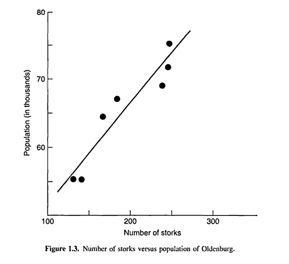

```{r setup, include=FALSE}
source("setup_knitr.R")
```

# O processo de aprendizado

> "*Conhecimento é poder*"

- Conhecimento é a chave para a inovação (e lucro, se você estiver
  pensando nisso)
- Mas a geração de conhecimento pode ser complexa, demorada e cara
- Para ter sucesso nessa tarefa você deve **aprender a aprender**. Essa
  é a chave para:
    - geração de ideias
    - melhoria de processos
    - desenvolvimento de novos produtos

## Aprendizado dedutivo-indutivo

- O processo **dedutivo-indutivo** de aprendizado é orientado pelo
  cérebro humano
- É conhecido desde o tempo de Aristóteles e faz parte de nossa
  **experiência cotidiana**

O aprendizado avança conforme ilustrado na figura abaixo (extraída de
Box, Hunter e Hunter):

```{r, echo=FALSE, out.width='80%'}
include_graphics("img/deduction-induction.png")
```


- Uma ideia inicial (modelo, hipótese, etc) é levada por um processo de
  **dedução** para algumas consequências
- As consequências são comparadas com **dados** (informação)
- Quando as consequências e os dados não concordam, essa discrepância
  leva a uma modificação do modelo, um processo chamado de **indução**
- Um segundo ciclo se inicia: as consequências do novo modelo são
  comparadas com dados, que pode levar à uma nova modificação e
  consequente **ganho de conhecimento**
- O **processo de aquisição de dados** pode ser:
    - experimentação científica
    - uma consulta na biblioteca
    - uma pesquisa na internet
    - ...

Por exemplo, ao chegar ao trabalho uma pessoa estaciona seu carro todos
os dias na mesma vaga de garagem. Uma tarde, após sair do trabalho, ele
é levado à seguinte sequência de aprendizado dedutivo-indutivo:

<br>

|         |   |
|---------|-----------------------------------|
|*Modelo*:| Hoje é um dia como outro qualquer  |
|*Dedução*:| Meu carro estará na vaga de sempre|
|*Dados*:| Não está|
|*Indução*:| Alguém o pegou  |

<br>

|         |   |
|---------|-----------------------------------|
|*Modelo*:| Meu carro foi roubado|
|*Dedução*:| Meu carro não estará no estacionamento|
|*Dados*:| Não! Está lá!|
|*Indução*:| Alguém pegou e o troxe de volta|

<br>

|         |   |
|---------|-----------------------------------|
|*Modelo*:| Um ladrão roubou e o trouxe de volta|
|*Dedução*:| Meu carro estará arrombado|
|*Dados*:| Está sem danos e trancado|
|*Indução*:| Alguém que tem as chaves o pegou|

<br>

|         |   |
|---------|-----------------------------------|
|*Modelo*:| Minha esposa usou meu carro|
|*Dedução*:| Ela provavelmente deixou um bilhete|
|*Dados*:| Aqui está!|

<br>

Suponha que para resolver um problema, uma especulação inicial produz
uma ideia:

- Você busca por dados para suportar ou refutar sua teoria
- A busca por dados pode ser:
    - uma busca nos seus arquivos ou na internet
    - uma consulta na biblioteca
    - uma reunião com seus colegas
    - observação passiva de um processo
    - experimentação ativa
- Em qualquer caso, os dados podem:
    - confirmar sua conjectura, e o problema está resolvido
    - mostrar que sua ideia estava parcialmente ou totalmente errada
- Neste segundo caso, a diferença entre dedução e **realidade** é que
  faz com que você continue procurando
- Isto pode levar para uma ideia modificada ou totalmente diferente,
  para reanálise dos dados ou geração de novas informações
- O cérebro humano possui dois lados especificamente desenvolvidos para
  lidar com a lógica do pensamento indutivo-dedutivo. No entanto, não
  devemos esperar que a **natureza da solução** ou o **caminho** que
  levou a ela sejam **únicos**

## Um loop de feedback

A figura abaixo mostra o processo dedutivo-indutivo como um "loop de
feedback" (extraída de Box, Hunter e Hunter):

```{r, echo=FALSE, out.width='90%'}
include_graphics("img/feedback-loop.png")
```

- Por **dedução**, você considera as consequências esperadas de $M_1$
    - O que aconteceria se $M_1$ fosse verdadeiro ou falso
- Você também **deduz** quais dados são necessários para explorar $M_1$
    - O plano experimental (*design*) que você escolhe é apenas uma
      janela sob o verdadeiro estado da natureza
    - Lembre-se que quando você conduz um experimento, a janela é *sua*
      escolha
- Os dados produzidos representam algum aspecto do verdadeiro estado da
  natureza, ofuscados por um maior ou menor **ruído**, ou seja, o **erro
  experimental**
- Os dados analisados são comparados com o que foi **deduzido** do
  modelo $M_1$
    - Se eles concordam, o problema esté resolvido
    - Se há discordância, o modelo $M_1$ deve ser modificado
    - Usando **os mesmos dados**, você pode considerar análises
      alternativas ($M'_1$, $M''_1$, $\ldots$)
- Pode-se tornar claro que uma nova ideia ou modelo $M_2$ deve ser
  formulada
- Isto pode requerer um novo plano experimental, para contemplar
  diferentes aspectos do verdadeiro estado da natureza

# Considerações importantes

## Conhecimento do assunto

Note a importância do **conhecimento do assunto** ao qual você está
pesquisando, para perceber e explorar modelos alternativos e saber onde
procurar ajuda.

## O caminho não é único

- Claramento, o **caminho para a solução de um problema** não é único
- O objetivo é **convergir** para uma solução satisfatória
    - O ponto de partida e o caminho poderão ser diferentes para
      diferentes pessoas


- O "Joga das 20 questões" ilustra bem esse processo, e segue o que foi
  exposto nas figuras acima
    - o "plano experimental" é a escolha da questão
    - a resposta é a "dado"
    - que leva à uma nova conjectura e plano experimental (questão)
    - esse caminho claramente será diferente para diferentes jogadores

- As qualidades necessárias para esse jogo são:
    a. conhecimento do assunto
    b. conhecimento da estratégia
- **Conhecimento de estratégia** é paralelo ao **conhecimento de métodos
  estatísticos**
    - note que sem o conhecimento da estratégia, você pode sempre jogar
      esse jogo (talvez não muito bem)
    - no entanto, sem o conhecimento do assunto, não é nem possível
      jogá-lo
- Claramente o melhor é usar ambos conhecimentos, da estratégia e do
  assunto
    - É possível conduzir uma investigação sem conhecimento estatístico,
      mas impossível sem conhecimento do assunto
    - Obviamente, ao usar conhecimentos estatísticos, a convergência
      para a solução do problema é muito mais rápida, e um bom
      investigador se torna um melhor ainda

# Os problemas do investigador

## Complexidade

Quando fazemos experimentos para a melhoria de um processo, é necessário
considerar a **influência simultânea** de uma série de **variáveis de
entrada** (e.g. temperatura, concentração , catalisador, etc) em uma
coleção de **variáveis de saída** (e.g. rendimento, impureza, custo,
etc).

Chamamos as variáveis **controladas** de entrada de **fatores**, e as
variáveis de saída de **respostas**.

A princiapl questão é

> *O que faz o que, e para quem?*

Com $k$ fatores e $p$ respostas, existem $k \times p$ entidades a serem
consideradas. Além disso:

- Um certo conjunto de fatores (e.g. temperatura e pressão) pode causar
  efeito em apenas uma resposta (e.g. rendimento)
- Um outro conjunto (possivelmente sobreposto, e.g. temperatura e
  concentração), causa interferência outra resposta (e.g. pureza)
- Alguns fatores irão **interagir** na presença de outros
- Por isso, o uso do "mudar um fator por vez" dificilmente produzirá
  resultados satisfatórios e viáveis economicamente

O uso de **planejamentos estatísticos experimentais** é a melhor forma
de "testar" um grande número de fatores simultaneamente e conseguir uma
visão de como eles se comportam isoladamente e em conjunto, ao mesmo
tempo que minimiza a influência de **erros experimentais**.

## Erros experimentais

A variabilidade não explicada por fatores conhecidos é chamada de **erro
experimental**.

- Como *algum* erro experimental é **inevitável**, saber lidar como ele
  é fundamental
- Um bom planejamento experimental ajuda a a proteger que os efeitos
  reais de um fator sejam ofuscados por erros experimentais
- Além disso, as análises estatísticas fornecem **medidas de precisão**
  das quantidades estimadas no estudo (e.g. médias, parâmetros)
    - Isso torna possível verificar se ocorre de fato uma **evidência
      concreta** na existência de **efeitos reais**

## Correlação e causalidade

A figura abaixo mostra a relação entre o tamanho da população de
Oldenburg e o número de cegonhas, observados ao final de 7 anos
(extraído de Box, Hunter e Hunter):

```{r, echo=FALSE, out.width='80%'}

```

O número de cegonhas **causou** o aumento da população?

A correlação entre duas variáveis $Y$ e $X$ geralmente ocorre porque
ambas estão associadas com uma terceira variável $W$. (Nesse caso, $W$
seria o *tempo*).

# Como usar técnicas estatísticas

## Descubra o quanto puder sobre o problema

Faça perguntas até estar satisfeito de que entende o problema totalmente
e está ciente dos recursos necessários para estudá-lo.

Algumas perguntas:

- Qual é o objetivo da investigação?
- Existem dados prévios?
- Como os dados foram coletados?
- Em que ordem? Por quem?
- Como as respostas foram medidas?
- O quanto já se conhece sobre o problema?

## Conhecimento não-estatístico

- Não negligencie seu conhecimento ou de seus colegas sobre o problema
- Métodos estatísticos são inúteis sem conhecimento do assunto e
  experiência

## Defina objetivos

1. Defina claramente os objetivos do estudo
2. Tenha certeza de que todas as partes envolvidas concordam com os
   objetivos
3. Certifique-se de que possui todos os equipamentos, dinheiro,
   computadores para executar a proposta
4. Defina claramente o critério que irá determinar quando os objetivos
   forem alcançados
5. Se os objetivos tiverem que ser alterados, faça com que todos os
   interessados saibam e concordem

## Interação entre teoria e prática

Enquanto investigadores ganham a partir do uso de métodos estatísticos,
o contrário é ainda mais verdadeiro. Um especialista em estatística pode
se beneficiar enormemente de suas discussões com pesquisadores de
outras áreas.

A geração de ideias realmente novas em estatística parece sempre surgir
de interesses em problemas práticos:

- **Sir Ronald Fisher** (inventor de praticamente todas as ideias que
  veremos nesse curso) foi um cientista que gostava de trabalhar de
  perto com outros investigadores
- **William S. Gosset** (aka "Student") possuia uma conexão muito forte
  entre a pesquisa estatística e os problemas práticos com os quais
  lidava

Os trabalhos de Fisher e Gosset são uma marca da "boa ciência", a
interação entre teoria e prática. Seu sucesso como cientista e suas
habilidades de desenvolver técnicas estatísticas **úteis** foram
altamente dependentes de seus envolvimentos com o trabalho experimental.

# Referências

- Box, GEP; Hunter, JS; Hunter, WG. [Statistics for experimenters:
  Design Innovation and Discovery](http://statisticsforexperimenters.net).
  John Wiley & Sons, 2005.
