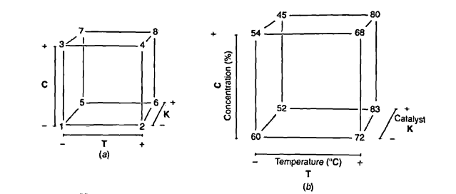
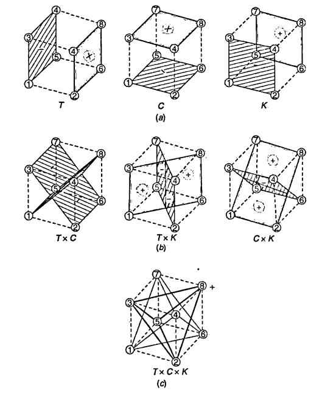

```{r setup, include=FALSE}
library(knitr, quietly = TRUE)
opts_chunk$set(
               cache = TRUE,
               tidy = FALSE,
               comment = "#",
               collapse = TRUE,
               fig.align = "center",
               fig.path = "figures/",
               cache.path = "cache/"
           )
```

# Introdução

Já vimos que em geral, os experimentos fatoriais $2^k$ são compostos por
$k$ tratamentos, cada um com apenas dois níveis (que chamamos de alto e
baixo). A representação geométrica e as formas de estimação para todos
os componentes de um experimento fatorial $2^2$ já foram vistas
[aqui](fatorial_2-2.Rmd).

Nesta seção veremos as adatações necessárias para se obter todos os
componentes de um experimento fatorial com 3 fatores, cada um com dois
níveis. O modelo estatístico geral para um experimento fatorial $2^3$
pode ser escrito como

$$
y_{ijkl} = \mu + \alpha_i + \beta_j + \gamma_k + (\alpha\beta)_{ij} +
         (\alpha\gamma)_{ik} + (\beta\gamma)_{jk} +
         (\alpha\beta\gamma)_{ijk} + \epsilon_{ijkl}
$$

Com $i = 1, \ldots, a$ niveis do fator A $j = 1, \ldots, b$ niveis do
fator B, $k = 1, \ldots, c$ niveis do fator C, e $l = 1, \ldots, r$
repetições. De maneira simpllificada podemos também escrever esse modelo
como

$$
y = A + B + C + AB + AC + BC + ABC + \epsilon
$$

Portanto, esse planejamento permite estimar 3 efeitos principais, 3
efeitos de interações de segunda ordem, e 1 interação de terceira ordem.

Usando a representação geométrica (que já vimos ser equivalente à
restrição do tipo soma zero em modelos lineares gerais), temos agora um
cubo, onde cada dimensão representa um fator:

```
        bc ------- abc
        .|        .|
 [+]  c__|______ac |
      |  |      |  |
  C   |  b -----|- ab [+]
      | .       | .   B
 [-] (1)________a  [-]
     [-]   A   [+]
```

Dessa forma, obtemos também a seguinte tabela de sinais para os afeitos
principais, seguindo a ordem de Yates:

```
   nom A B C
 1   1 - - -
 2   a + - -
 3   b - + -
 4  ab + + -
 5   c - - +
 6  ac + - +
 7  bc - + +
 8 abc + + +
```

As colunas das interações são obtidas multiplicando-se as colunas dos
respectivos fatores. Nota-se que em um experimento fatorial $2^3$ temos
então 8 combinações possíveis para os 3 tratamentos.

# Análise através de um exemplo

No capítulo 5 de [Box, Hunter e Hunter
(2005)](http://statisticsforexperimenters.net) é apresentado um
experimento que avalia o rendimento de um processo na presença de 3
fatores: temperatura (**T**) e concentração (**C**), ambos
quantitativos, e tipo de catalisador (**K**), qualitativo. O experimento
foi executado com 2 repetições, e pode ser visto abaixo (disponível
[aqui](http://leg.ufpr.br/~fernandomayer/data/BHH2/tab0503.dat)):

```{r}
url <- "http://leg.ufpr.br/~fernandomayer/data/BHH2/tab0503.dat"
dados <- read.table(url, header = TRUE)
str(dados)
```

Em um primeiro momento, para simplificação da explicação abaixo, foi
considerado como resposta a média de rendimento das duas repetições do
experimento, ficando apenas com 8 observações. Estes dados podem ser
visualizados abaixo:

```{r}
da <- aggregate(y ~ T + C + K, data = dados, FUN = mean)
str(da)
kable(da)
```

Os níveis -1 (baixo) e 1 (alto) de cada fator são os seguintes:

|   |  **(-)** |  **(+)** |
|:-:|:---:|:---:|
| **T**  | 160 | 180 |
| **C** |  20 |  40 |
| **K** |  A  |  B  |

A representação geométrica desse experimento é então:

```{r, echo=FALSE, out.width='80%'}

```

E as definições básicas são:

```{r}
## Número de fatores
k <- 3
## Número de níveis
a <- b <- c <- 2
## Número de repetições
r <- 1
```

## Contrastes

Já vimos que um contraste é, por definição, a diferença entre as
observações do nível alto e baixo de um fator. No caso de um experimento
fatorial $2^2$ essa dedução é simplificada pois a representação
geométrica é um quadrado. Naquele caso bastava olhar para a diferença
entra as médias das arestas paralelas do quadrado.

No caso de um experimento fatorial $2^3$ onde a representação geométrica
se dá em um cubo, a dedução é a mesma, mas agora as diferenças serão
realizadas entre **planos** do cubo. Por exemplo, o contraste para o
fator A (temperatura) pode ser calculado como:

$$
contr_A = (a + ab + ac + abc) - (b + c + bc + (1))
$$

Note que todos os elementos da primeira soma contém a letra $a$ que
representa o nível alto do fator A. De maneira análoga, podemos deduzir
os contrastes para os fatores B e C:

$$
\begin{align}
contr_B = (b + ab + bc + abc) - (a + c + ac + (1)) \\
contr_C = (c + ac + bc + abc) - (a + b + ab + (1))
\end{align}
$$

Os contrastes para as interações podem ser obtido de maneira similar.
Considere por exemplo a interação $TK$. Quando a concentração ($C$) está
no nível baixo, então

$$
contr_{TK(C-)} = ((1) + ab) - (a + b)
$$

E quando a concentração está no nível alto, então

$$
contr_{TK(C+)} = (c + abc) - (ac + bc)
$$

Portanto, a interação $TK$ é simplesmente a soma das interações para
cada nível de $C$. Assim, de maneira geral, o contraste da
interação $AB$ é

$$
contr_{AB} = (ab + (1) + abc + c) - (a + b + ac + bc)
$$

De maneira similar, os contrastes para as outras duas interações duplas
são:

$$
\begin{align}
contr_{AC} = (ac + (1) + abc + b) - (a + c + ab + bc) \\
contr_{BC} = (bc + (1) + abc + a) - (b + c + ab + ac)
\end{align}
$$

O efeito da interação de terceira ordem ($TCK$) é obtida quando se
considera a interação $TC$ nos níveis alto e baixo de $K$, mas com os
sinais trocados. De maneira geral, a interação ABC é obtida a partir da
interação de AB em cada nível de C, ou seja,

$$
contr_{ABC} = (a + b + c + abc) - ((1) + ab + ac + bc)
$$

Geometricamente os contrastes acima podem ser visualizados na figura
abaixo.

```{r, echo=FALSE, out.width='80%'}

```

### Tabela de contrastes

Note que a partir do momento que o número de fatores $k$ for aumentando,
a dedução geometrica ficará cada vez mais difícil. Por isso, podemos
utilizar a **tabela de contrastes** para auxiliar no cálculo dos
contrastes de qualquer ordem.

Para qualquer experimento fatorial $2^k$ definimos a tabela de
contrastes como sendo a tabela de sinais para cada fator, adicionada das
colunas de média geral (que chamaremos de $I$) e das colunas com todas
as interações possíveis.

Dessa forma, a partir da tabela de sinais do experimento

```{r}
da[, c("T", "C", "K")]
```

obtemos a tabela completa de contrastes da seguinte forma:

```{r}
tab.sinais <- cbind(I = 1, da[, c("T", "C", "K")])
tab.sinais <- transform(tab.sinais,
                        TC = T*C,
                        TK = T*K,
                        CK = C*K,
                        TCK = T*C*K)
row.names(tab.sinais) <- c("(1)", "a", "b", "ab", "c", "ac", "bc", "abc")
tab.sinais
```

Note agora que cada coluna da tabela de sinais representa a própria
definição de contraste para cada efeito principal ou interação, conforme
foi deduzido anteriormente.

Dessa forma, os contrastes podem ser facilmente calculados apenas
multiplindo-se cada coluna pelo vetor de observações:

```{r}
(contr <- t(tab.sinais[, -1]) %*% da$y)
```

Note que a tabela de sinais completa para qualquer experimento fatorial
$2^k$ pode ser obtida dessa mesma forma. Essa tabela possui algumas
propriedades extremamente interessantes:

1. Exceto pela coluna identidade $I$, cada coluna tem um número igual de
   sinais mais ou menos.
2. A soma dos produtos dos sinais de quaisquer duas colunas é zero. Isto
   é, o **produto interno** de qualquer par de colunas será zero, o que
   define que os contrastes são **ortogonais**, garantindo que cada
   estimativa de efeito não é alterada pela magnitude dos efeitos e
   sinais das outras.
3. A multiplicação de qualquer coluna pela couna $I$ deixa a coluna
   inalterada, ou seja, $I$ é um **elemento identidade**.
4. O produto de quaisquer duas colunas resulta em uma coluna da tabela.
   Por exemplo: $A \times B = AB$ e $AB \times ABC = A^2B^2C = C$, uma
   vez que cada coluna multiplicada por si mesma é a identidade.

A partir dos contrastes, podemos agora calcular os efeitos de cada fator
e das interações. Vimos que, de forma, geral, os efeitos são

$$
\begin{align}
Ef &= \bar{y}_{+} - \bar{y}_{-} \\
   &= \frac{contr}{r2^{k-1}}
\end{align}
$$

Dessa forma, os efeitos podem ser calculados como:

```{r}
(ef <- contr/(r * 2^(k-1)))
```

Os efeitos principais de um fator podem ser interpretados
individualmente somente se não existem evidências de que aquele fator
não interage com outros. Quando existe interação, as variáveis que
interagem devem ser analisados em conjunto.

Pelos resultados acima, apenas a interação $TK$ parece ser importante.
Dessa forma, temperatura e catalisador não podem ter seus efeitos
analisados individualmente (independente do tamanho dos efeitos
individuais). De maneira geral, as seguintes conclusões podem ser
obtidas:

1. O efeito de mudar a concentração ($C$) de alta para baixa, é diminuir
   o rendimento em 4.75 unidades, **independente do nível das outras
   variáveis**, pois não há interação com essa variável.
2. Os efeitos de temperatura ($T$) e catalisador ($K$) não podem ser
   interpretados separadamente por causa do grande efeito da interação
   $TK$. O aumento no rendimento é muito maior ao se utilizar o
   catalisador B (1) do que o A (-1), conforme podemos ver na figura
   abaixo.

```{r}
with(da, interaction.plot(T, K, y))
```

Embora essa análise visual nos permita tirar algumas conclusões, devemos
nos preocupar em testar se os efeitos são realmente significativos ou se
seus valores observados são apenas devido ao acaso. Com apenas uma
repetição do experimento não é possível obter estimativas de erro e nem
testar hipóteses. Por isso, para os demais tópicos que seguem, vamos
utilizar os dados completos, considerando as duas repetições do
experimento.

Os contrastes para o experimento completo são então:

```{r}
## Obtém tabela de sinais
tab.sinais <- cbind(I = 1, dados[, c("T", "C", "K")])
tab.sinais <- transform(tab.sinais,
                        TC = T*C,
                        TK = T*K,
                        CK = C*K,
                        TCK = T*C*K)
tab.sinais
## Calcula os contrastes pela tabela de sinais
(contr <- t(tab.sinais[, -1]) %*% dados$y)
```

Assim como esperado, os contrastes agora são o dobro daqueles obtidos
anteriormente, uma vez que utilizamos a média das duas repetições.

## Somas de quadrados e ANOVA

Já foi demonstrado também que a soma de quadrados de qualquer fator pode
ser calculada como

$$
SQ = \frac{[contr]^2}{r2^k}
$$

onde os contrastes são específicos para cada fator e $r2^k$ é o total de
observações do experimento.

Para esse exemplo específico temos então

```{r}
## Novas definições do experimento
k <- 3
a <- b <- c <- 2
r <- 2 # aumenta o número de repetições
n <- r*2^k
(SQ <- contr^2/(r * 2^k))
```

Para calcular os quadrados médios precisamos dos graus de liberdade.
Para um experimento fatorial $2^k$ as somas de quadrados e os graus de
liberdade podem ser decompostos em:

$$
\begin{align}
SQTot &= SQA + SQB + SQC + SQAB + SQAC + SQBC + SQABC + SQRes \\
abcr - 1 &= (a-1) + (b-1) + (c-1) + (a-1)(b-1) + (a-1)(c-1) +
(b-1)(c-1) + (a-1)(b-1)(c-1) + abc(r-1)
\end{align}
$$

(Obtenha essas quantidades pelo diagrama de Hasse). A $SQTot$ é
calculada da maneira usual, e a $SQRes$ obtida por diferença:

```{r}
## SQTot
(SQTot <- sum(dados$y^2) - (sum(dados$y)^2/n))
## SQRes
(SQRes <- SQTot - sum(SQ))
```

Assim, os graus de liberdade são:

```{r}
(glA <- a - 1)
(glB <- b - 1)
(glC <- c - 1)
(glAB <- (a-1)*(b-1))
(glAC <- (a-1)*(c-1))
(glBC <- (b-1)*(c-1))
(glABC <- (a-1)*(b-1)*(c-1))
(glRES <- a*b*c*(r-1))
```

E os quadrados médios são, portanto,

```{r}
(MQ <- SQ/c(glA, glB, glC, glAB, glAC, glBC, glABC))
## Resíduo
(MQRes <- SQRes/glRES)
```

Para completar a tabela de ANOVA, calculamos os valores F, os p-valores
correspondentes e montamos a tabela final:

```{r}
## Valores F
f <- MQ/MQRes
## Valores p
p <- pf(f, df1 = glA, df2 = glRES, lower.tail = FALSE)
## Tabela de ANOVA
tab.anova <- data.frame("GL" = c(glA, glB, glC, glAB, glAC, glBC, glABC, glRES),
                        "SQ" = c(SQ, SQRes),
                        "QM" = c(MQ, MQRes),
                        "F" = c(f, NA),
                        "p-valor" = c(p, NA),
                        row.names = c("T", "C", "K", "T:C", "T:K",
                                      "C:K", "T:C:K", "Resíduo"))
tab.anova
```

Lembrando que a ANOVA testa as hipóteses de que as médias são iguais
para cada fator, concluimos então que a interação $TK$ é importante e o
efeito isolado de $C$ também. O efeito de $K$ sozinho não é importante,
mas pelo princípio da marginalidade esse termo deve permanecer no
modelo.

## Efeitos, coeficientes e erro-padrão

Como já mencionado acima, os efeitos são as diferenças entre as médias
dos níveis alto e baixo de um fator, e que podem ser calculadas a partir
dos contrastes como:

$$
\begin{align}
Ef &= \bar{y}_{+} - \bar{y}_{-} \\
   &= \frac{contr}{r2^{k-1}}
\end{align}
$$

Com isso os efeitos calculados são:

```{r}
(ef <- contr/(r*2^(k-1)))
```

Note que os efeitos são os mesmos que obtivemos antes quando tinhamos
apenas a média disponível.

Os coeficientes dos efeitos são a metade dos efeitos,

$$
\hat{\beta} = Coef = \frac{Ef}{2}
$$

E portanto são:

```{r}
(coef <- ef/2)
```

Com isso, podemos calcular os erros-padrões dos coeficientes dos efeitos
através de

$$
EP[\hat{\beta}] = \hat{\sigma} \sqrt{(1/r2^k)}
$$

Onde $\hat{\sigma}$ é uma estimativa do desvio-padrão amostral, obtida
através do quadrado médio do resíduo, ou seja,

$$
\hat{\sigma} = \sqrt{QMRes}
$$

Então:

```{r}
(sigma <- sqrt(MQRes))
(ep <- sigma * sqrt((1/(r * 2^k))))
```

Sabemos também que $\frac{\hat{\beta}}{EP[\hat{\beta}]}$ tem distribuição
$t$ com graus de liberdade igual aos graus de liberdade da soma de
quadrados do resíduo (ou da estimativa da variância). Por isso, podemos
fazer um teste $t$ para a hipótese $H_0: \beta = 0$.

Com isso, calculamos os valores $t$, os respectivos p-valores, e
montamos a tabela final com as estimativas e testes para os coeficientes
dos efeitos:

```{r}
## Valores t
t <- coef/ep
## Valores p
p <- pt(abs(t), df = glRES, lower.tail = FALSE) * 2
## Tabela final
tab.coef <- data.frame(Coeficientes = coef,
                       EP = ep,
                       t = t,
                       "p-valor" = p)
tab.coef
```

Nota-se então que, de acordo com a tabela de ANOVA, os efeitos
significativamente diferentes de zero são da interação $TK$ e do efeito
isolado de $C$.

# Análise usando as funções do R

Nesta seção usaremos as funções básicas do R para executar a análise
deste experimento, mas agora avaliando o melhor modelo, analisando
resíduos e fazendo a predição.

## Análise exploratória

```{r}
## Gráficos de interação
par(mfrow = c(1, 3))
with(dados, {
     interaction.plot(T, K, y)
     interaction.plot(C, K, y)
     interaction.plot(T, C, y)
})
par(mfrow = c(1, 1))
## Usando o pacote dae
dae::interaction.ABC.plot(y, T, C, K, data = dados)
dae::interaction.ABC.plot(y, T, K, C, data = dados)
```

## ANOVA e coeficientes dos efeitos

A declaração do modelo completo pode ser feita da seguinte forma:

```{r}
## Modelo usando lm()
m0 <- lm(y ~ T * C * K, data = dados)
```

Quando ajustamos um modelo a um conjunto de dados, podemos ter
basicamente dois objetivos:

1. Verificar quais variáveis influenciam na média da variável resposta
   $Y$
2. Fazer predições com base nos parâmetros estimados

Para verificar as variáves que infuenciam na resposta, vemos a ANOVA do
modelo,

```{r}
anova(m0)
```

Se o nosso objetivo fosse simplesmente construir um modelo para avaliar
quais efeitos e interações influenciam no processo, então a análise
poderia parar aqui, pois já temos esse resultado. Então deveria se
proceder para a análise dos resíduos para verificar as suposições do
modelo.

Caso o nosso objetivo seja fazer uma predição para a variável resposta,
então devemos ajustar o modelo mais **parcimonioso** possível. Um modelo
parcimonioso é aquele que consegue explicar a maior parte da
variabilidade dos dados, com o menor número de parâmetros possível.

Verificando os resultados da ANOVA, vemos que a interação TK é
significativa, assim como T e C. Pelo princípio da marginalidade,
devemos também manter o efeito K, mesmo não sendo significativo, pois
ele está presente na interação TK. Assim, atualizamos o modelo da
seguinte forma:

```{r}
m1 <- update(m0, . ~ T*K + C)
```

Como, por construção, o modelo é ortogonal, então as somas de quadrados
e os coeficientes estimados também serão ortogonais. Dessa forma, a
retirada de termos do modelo não interfere nos coeficientes
estimados. No caso da ANOVA, as somas de quadrados permanecem as mesmas,
mas a $SQRes$ e os $GL$ associados aumentam, pois as $SQ$ dos fatores
retirados são incorporados aos resíduos. Veja:

```{r}
anova(m0)
anova(m1)
```

Porque se alteram os p-valores?

```{r}
## Exemplo para T
## Usando o modelo completo
pf(anova(m0)$"F value"[1], df1 = anova(m0)$"Df"[1],
   df2 = anova(m0)$"Df"[8], lower.tail = FALSE)
## Exemplo para o modelo sob avaliação
pf(anova(m1)$"F value"[1], df1 = anova(m1)$"Df"[1],
   df2 = anova(m1)$"Df"[5], lower.tail = FALSE)
```

Porque mudam os graus de liberdade do numerador e do denominador, altera
a distribuição.

Para comparar se o modelo reduzido pode de fato ser utilizado no lugar
do modelo completo, podemos fazer o **teste da razão de
verossimilhança** (TRV) entre os dois modelos encaixados.

```{r}
anova(m1, m0)
```

Como a diferença das somas de quadrados residuais entre os dois modelos
não é significativa, então concluímos que o modelo com menos parâmetros
pode ser utilizado no lugar do modelo com mais parâmetros - este é o
**princípio da parcimônia**.

Concluímos então que o modelo que melhor explica a variável resposta é o
segundo, com menos termos, e é esse modelo que deve ser utilizado para
predição ou inferância.

Os coeficientes estimados e respectivos erros e teste de hipótese podem
ser obtidos com o `summary()`:

```{r}
summary(m1)
```

Note que se compararmos esse resultado com aquele do modelo completo:

```{r}
summary(m0)
```

notamos que as estimativas dos coeficientes não se alteram (pois são
ortogonais), mas os erros são alterados. Isso ocorre porque os graus de
liberdade dos resíduos foram alterados quando passamos do modelo
completo para o modelo reduzido

## Análise dos resíduos

Para verificar as suposições feitas para o modelo, procedemos com a
análise dos resíduos do modelo final.

A melhor forma de verificar a suposição de normalidade é através do
gráfico de quantis normais:

```{r}
## Obtém os resíduos do modelo final
res <- residuals(m1)
## Gráfico de quantis normais
qqnorm(res); qqline(res)
```

Para verificar a suposição de homegeneidade de variâncias podemos fazer
um gráfico dos resíduos versus cada fator do modelo final:

```{r}
par(mfrow = c(2, 2))
with(dados, {
    plot(res ~ T)
    abline(h = 0, lty = 2, col = 2)
    plot(res ~ C)
    abline(h = 0, lty = 2, col = 2)
    plot(res ~ K)
    abline(h = 0, lty = 2, col = 2)
    plot(res ~ interaction(T, K))
    abline(h = 0, lty = 2, col = 2)
})
par(mfrow = c(1, 1))
```

## Predição

A partir dessa avaliação, podemos fazer a predição usando os coeficientes
estimados do modelo

```{r}
summary(m1)
```

```{r}
## Predição para as combinações únicas dos fatores
pred <- expand.grid(T = seq(-1, 1, length = 20),
                    C = seq(-1, 1, length = 20),
                    K = seq(-1, 1, length = 20))
## Faz o cálculo das predições para esse grid
pred$y <- predict(m1, newdata = pred)
## E existem várias formas de visualizar as predições
wireframe(y ~ T * K, data = pred, drape = TRUE)
levelplot(y ~ T * K, data = pred, cuts = 90)
levelplot(y ~ T * K, data = pred, cuts = 90,
          col.regions = heat.colors)
```

```{r, eval=FALSE, include=FALSE}
m1aov <- aov(y ~ factor(T)*factor(K) + factor(C), data = dados)
summary(m1aov)
TukeyHSD(m1aov)
```
