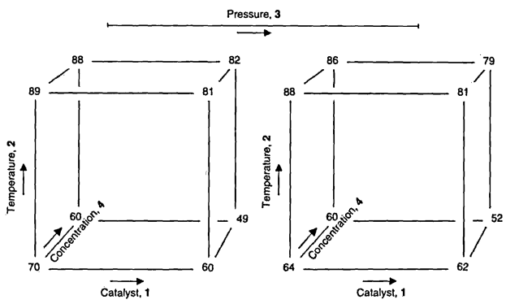

```{r setup, include=FALSE}
library(knitr, quietly = TRUE)
opts_chunk$set(
               cache = TRUE,
               tidy = FALSE,
               comment = "#",
               collapse = TRUE,
               fig.align = "center",
               fig.path = "figures/",
               cache.path = "cache/"
           )
```

```{r external-code, cache=FALSE, include=FALSE}
knitr::read_chunk("scripts/fatorial_2-k_respostas.R")
```

# Introdução

A medida que o número de fatores cresce em um experimento fatorial,
o número de efeitos que podem ser estimados também cresce. Com isso,
fazer o experimento com replicação acaba sendo praticamente inviável.
Por exemplo:

- $2^4$ possui 4 efeitos principais, 6 interações de segunda ordem, 4
  interações de terceira ordem, e 1 interação de quarta ordem
- $2^6$ possui 6 efeitos principais, 15 interações de segunda ordem, 20
  interações de terceira ordem, 15 interações de quarta ordem, 6
  interações de quinta ordem, e 1 interação de sexta ordem

Geralmente existem mais fatores a serem estudados do que pode ser
convenientemente acomodado dentro do tempo e orçamento disponível. No
entanto, veremos que geralmente é possível separar efeitos
significativos de erros ao acaso sem a necessidade de replicação. Dessa
forma, no exemplo analisado [anteriormente](fatorial_2-3.html), ao invés
de utilizarmos 16 corridas para produzir um fatorial $2^3$ replicado,
poderíamos ter introduzido um quarto fator e realizar um experimento
$2^4$ **sem** réplicas.

Em muitas situações, o **princípio da esparsidade dos efeitos** se
aplica, ou seja, o sistema geralmente é dominado pelos efeitos
principais e pelas interações de ordens baixas. As interações de
terceira ordem ou superiores geralmente são negligenciadas.

Como consequência, quando o número de fatores for moderadamente grande,
como $k = 4$ ou, em geral, $k \geq 5$, uma prática comum é correr
somente uma réplica do planejamento, e então combinar as interações de
ordem alta como uma estimativa do erro. No entanto, se eventualmente
alguma interação de ordem alta for significativa, então esse
procedimento não é adequado.

Um método simples para verificar o tamanho dos efeitos de um fator foi
proposta por Daniel (1959), que consiste em construir um gráfico das
estimativas dos efeitos em uma escala de probabilidade normal. Por
construção, a distribuição dos efeitos estimados possui média zero e
variância $\sigma^2$. Portanto, os efeitos que forem desprezíveis
estarão em cima de uma linha reta nesse gráfico, enquanto que efeitos
significativos não terão média zero e estarão mais afastados dessa
linha.

# Exemplo de um experimento $2^4$

## Representação geométrica

Para um experimento $2^4$, a representação geométrica fica:

```
           D [-]             |             D [+]
                             |
        bc ------- abc       |         bcd ------- abcd
        .|        .|         |          .|        .|
 [+]  c__|______ac |         |   [+] cd__|_____acd |
      |  |      |  |         |        |  |      |  |
  C   |  b -----|- ab [+]    |    C   | bd -----|- abd [+]
      | .       | .   B      |        | .       | .    B
 [-] (1)________a  [-]       |   [-]  d _______ ad  [-]
     [-]   A   [+]           |       [-]   A   [+]
```

O que gera a seguinte tabela de sinais, seguindo a ordem de Yates:

```
     nom A B C D
 1   (1) - - - -
 2     a + - - -
 3     b - + - -
 4    ab + + - -
 5     c - - + -
 6    ac + - + -
 7    bc - + + -
 8   abc + + + -
 9     d - - - +
 10   ad + - - +
 11   bd - + - +
 12  abd + + - +
 13   cd - - + +
 14  acd + - + +
 15  bcd - + + +
 16 abcd + + + +
```

No capítulo 5 de [Box, Hunter e Hunter
(2005)](http://statisticsforexperimenters.net) é apresentado um
experimento que avalia a taxa de conversão de um processo, conforme a
combinação de 4 fatores: carga de catalisador (`x1`), temperatura
(`x2`), pressão (`x3`), e concentração de um reagente (`x4`). O
experimento foi realizado sem repetições, e pode ser visualizado abaixo
(disponível
[aqui](http://leg.ufpr.br/~fernandomayer/data/BHH2/tab0510a.dat)):

```{r}
url <- "http://leg.ufpr.br/~fernandomayer/data/BHH2/tab0510a.dat"
dados <- read.table(url, header = TRUE)
str(dados)
kable(dados)
```

Como referência, os níveis -1 (baixo) e 1 (alto) de cada fator são os
seguintes:

|   |  **(-)** |  **(+)** |
|:--- |:---:|:---:|
| Carga de catalisador (`x1`) | 10  | 15  |
| Temperatura (`x2`) |  220 |  240 |
| Pressão (`x3`) |  50 |  80 |
| Concentração (`x4`) |  10 |  12 |

A representação geométrica desse experimento é então:

```{r, echo=FALSE, out.width='80%'}

```

E as definições básicas são:

```{r}
## Número de fatores
k <- 4
## Número de níveis
a <- b <- c <- d <- 2
## Número de repetições
r <- 1
```

## Análise exploratória

Uma possível forma de visualizar se existe interação nesse experimento é
através do sguinte gráfico:

```{r}
library(lattice)
## Interação de x2 com x3, para cada nível de x4, fixando x1
xyplot(conversion ~ factor(x1) | x2 + x3, groups = x4,
       data = dados,  type = c("p", "a"), auto.key = TRUE)
## Interação de x2 com x4, para cada nível de x3, fixando x1
xyplot(conversion ~ factor(x1) | x2 + x4, groups = x3,
       data = dados,  type = c("p", "a"), auto.key = TRUE)
```

Note que várias outras combinações são possíveis, assim como outras
formas de visualização. No entanto note que à medida que o número de
fatores ($k$) aumentar, este tipo de visualização ficará cada vez mais
difícil de ser interpretada.

## Contrastes, efeitos e avaliação do modelo

Como vimos anteriormente, podemos calcular os efeitos diretamente
através da tabela de contrastes. Agora, ao invés de calcularmos essa
tabela manualmente, podemos fazer uso da função `model.matrix()` do R.
Como as colunas dos fatores já estão codificadas no padrão -1 e 1, a
chamada dessa função produzirá a tabela de contrastes completa.

```{r}
## Declara o modelo completo com todas as interações possíveis
(tab <- model.matrix(~ x1 * x2 * x3 * x4, data = dados))
```

A partir dessa tabela podemos então calcular os contrastes e os efeitos:

```{r}
## Calcula os contrastes
(contr <- t(tab[, -1]) %*% dados$conversion)
## Calcula os efeitos
(ef <- contr/(r * 2^(k-1)))
```

Para testar quais efeitos são significativos, poderíamos pensar
inicialmente em fazer uma ANOVA. No entanto, este experimento não possui
repetição, e temos um parâmetro para cada observação, fazendo com que o
modelo seja saturado. Dessa forma, não temos como avaliar a
significância dos efeitos. Veja o resultado da ANOVA para o modelo
completo:

```{r}
anova(lm(conversion ~ (x1 * x2 * x3 * x4), data = dados))
```

Uma forma de verificar quais efeitos são importantes é através de um
**gráfico de probabilidade normal** para a estimativa dos efeitos.
Lembre-se que, sob a hipótses nula, todos os parâmetros do modelo são
iguais a zero, e pela definição do termo de erro do modelo, se os
parâmetros são iguais a zero, então sobra apenas o erro que possui média
0 e variância constante $\sigma^2$. Dessa forma, se a hipótese nula for
verdadeira, esperamos que os efeitos tenham também média 0, e fiquem em
cima da linha em um gráfico de probabilidade normal. Os efeitos que se
afastarem muito da linha são aqueles que possuem média diferente de
zero, e portanto, são aqueles que temos interesse.

```{r, fig.show='hold'}
## Gráfico de probabilidade normal dos efeitos estimados
qqaux <- qqnorm(ef, col = 2, pch = 19); qqline(ef)
text(qqaux$x, qqaux$y, rownames(qqaux$y), cex = 0.8, pos = 3)
```

Através do gráfico acima, vemos que os efeitos mais discrepantes são os
de `x1`, `x2`, `x4`, e da interação `x2:x4`. De maneira geral, termos de
ordem maior que 2 ficaram no centro, o que mostra que interações de
ordem grande podem ser consideradas como nulas. Portanto, para sermos
conservadores, podemos ajustar agora um modelo considerando apenas as
interações de segunda ordem.

```{r}
m0 <- lm(conversion ~ (x1 + x2 + x3 + x4)^2, data = dados)
anova(m0)
```

Note que a variabilidade das interações não consideradas foi encorporada
na soma de quadrado dos resíduos, e assim podemos agora ter uma
estimativa para $\sigma^2$.

Com esse resultado, confirmamos a hipótese levantada no gráfico de
probabilidades normais de que apenas 3 fatores principais e uma
interação são importantes. A interação `x2:x3` apareceu também como
marginalmente significativa. Por isso, podemos agora atualizar o modelo
com apenas esses termos. Na dúvida, podemos manter a interação `x2:x3`
para avaliação, e por consequência devemos manter também `x3` pelo
princípio da marginalidade.

```{r}
m1 <- update(m0, . ~ x1 + x2 + x3 + x4 + x2:x3 + x2:x4, data = dados)
anova(m1)
```

Já vimos que os valores F e por consequência os p-valores se alteram,
pois a soma de quadrados dos resíduos e os graus de liberdade residual
mudam de um modelo para outro. No entanto, as somas de quadrados dos
fatores não se alteram devido à ortogonalidade.

Assim, vemos que interação `x2:x3` é significativa, mas podemos avaliar
de sua presença é importante através do teste de razão de
verossimilhança entre esse modelo sob avaliação e outro modelo
desconsiderando esse termo e o `x3` (já que ele não é significativo):

```{r}
## Atualiza o modelo, retirando a interação x2:x3 e x3
m2 <- update(m1, . ~ x1 + x2*x4)
## Teste de razão de verossimilhança entre os dois modelos
anova(m1, m2)
```

Com esse resultado, não rejeitamos a hipótese nula de que os dois
modelos são iguais, e assim, optamos por aquele com menor número de
parâmetros pelo princípio da parcimônia.

Sendo assim, o modelo final que devemos adotar é aquele que inclui
apenas `x1`, `x2`, `x4`, e a interação `x2:x4`. A tabela de ANOVA final
é portanto:

```{r}
anova(m2)
```

Note que inicialmente esse experimento $2^4$ não possui repetições, e
portanto não tinhamos como calcular os erros para as estimativas. Ao
analisar quais efeitos eram de fato importantes, eliminamos a maior
parte das interações de alta ordem, fazendo com que tivessemos
"repetições", e dessa forma, conseguimos obter uma estimativa de erro
(que aqui é uma estimativa da variância, dada pelo quadrado médio dos
resíduos).

Os coeficientes dos efeitos podem então ser obtidos através do
`summary()`, que também calcula o erro-padrão destas estimativas e faz o
teste $t$ para a hipótese nula de que os coeficientes são zero.

```{r}
summary(m2)
```

Para efeito de interpretação, podemos multiplicar os coeficientes
estimados por 2, e assim obtemos os efeitos (quando se passa do nível
baixo para o alto de um fator). Portanto:

```{r}
c(coef(m2)[1], 2*coef(m2)[-1])
```

Como resultado, podemos dizer então:

1. Quando aumenta-se a carga de catalisador de 10 para 15 (nível baixo
   para nível alto), ocorre uma diminuição de 8 unidades na conversão
   (variável resposta).
2. Como existe interação entre temperatura (`x2`) e concentração (`x4`),
   os efeitos destes fatores devem ser considerados conjuntamente. Se
   analisarmos a interação destes dois efeitos isoladamente (veja figura
   abaixo), notamos que a diminuição de conversão é maior quando se
   utiliza o nível baixo de temperatura, o que caracteriza a interação.
   Veja também que o efeito calculado de 4.5 é obtido através dos
   contrastes destes dois fatores, calculados como se fosse um
   experimento $2^2$: [(65.25 + 83.75) - (55.25 + 84.75)]/4 = 4.5.
3. O fator pressão (`x3`) é essencialmente **inerte**, ou sem
   significância (pelo menos para este experimento), uma vez que nem seu
   efeito principal, nem nenhuma interação com qualquer outro fator
   produz algum efeito na conversão. Na prática isso significa que o
   nível de pressão não interfere na resposta, e assim pode ser
   escolhido aquele nível que otimize alguma outra resposta, como por
   exemplo o custo ou o tempo de operação.

```{r, fig.show='hold'}
with(dados, interaction.plot(x4, x2, conversion))
meds <- with(dados, tapply(conversion, factor(x2):factor(x4), mean))
text(1, meds[1], labels = meds[1], pos = 3)
text(2, meds[2], labels = meds[2], pos = 3)
text(1, meds[3], labels = meds[3], pos = 1)
text(2, meds[4], labels = meds[4], pos = 1)
```

Uma vez que o fator pressão (`x3`) não interfere no processo, podemos
tentar olhar o que acontece com a interação dos fatores que permaneceram
como influentes.

```{r}
## Tentativa de visualização
xyplot(conversion ~ factor(x2) + factor(x4) | x1,
       data = dados,  type = c("p", "a"), auto.key = TRUE)
```

Com esses resultados, vemos então que o experimento incial $2^4$, pode
agora ser reduzido para um experimento fatorial $2^3$, processo
denominado de **projeção de um experimento fatorial**. A partir desse
ponto, o experimentador possui duas opções:

1. Fazer um novo experimento, agora com apenas estes três fatores e com
um número maior de repetições: **projeção**
2. Fazer um novo experimento com estes três fatores e, se desejado,
outros fatores que não foram considerados no primeiro experimento. Nesse
caso é preciso lembrar que as podem haver interações entre estes novos
fatores e aqueles que foram descartados no primeiro experimento, e isto
não está sendo considerado neste caso.

## Análise dos resíduos

Para avaliar a suposição de normalidade podemos fazer um gráfico de quantis
normais para os resíduos:

```{r}
## Obtém os resíduos do modelo final
res <- residuals(m2)
## Gráfico de quantis normais
qqnorm(res); qqline(res)
```

E para verificar a suposição de homegeneidade de variâncias podemos fazer
um gráfico dos resíduos versus cada fator do modelo final:

```{r, fig.show='hold'}
par(mfrow = c(2, 2))
with(dados, {
    plot(res ~ x1)
    abline(h = 0, lty = 2, col = 2)
    plot(res ~ x2)
    abline(h = 0, lty = 2, col = 2)
    plot(res ~ x4)
    abline(h = 0, lty = 2, col = 2)
    plot(res ~ interaction(x2, x4))
    abline(h = 0, lty = 2, col = 2)
})
par(mfrow = c(1, 1))
```

## Predição

Como já vimos, as predições para experimentos fatoriais nada mais são do
que as estimativas das médias para cada combinação dos fatores,
incluindo a interação quando houver. Note que quando existe interação, o
modelo não é mais aditivo, e portanto, as médias simples, calculadas
apenas com fatores principais não serão estimativas corretas para o
experimento. Portanto, as médias estimadas só levam em consideração a
mudança nos níveis dos fatores importantes para o processo, independente
dos níveis dos outros fatores.

```{r}
## Predição para as combinações únicas dos fatores
pred <- data.frame(x1 = dados$x1,
                   x2 = dados$x2,
                   x4 = dados$x4)
pred$y <- predict(m2, newdata = pred)
pred
```

Note que a **projeção** do experimento, conforme vimos usando a função
`proj()` é exatamente a mesma coisa que a predição do modelo final para
cada nível dos fatores:

```{r}
## Projeção do experimento com proj()
proj(m2)
cbind(pred, yproj = apply(proj(m2)[,-6], 1, sum))
```

Como os fatores são quantitativos, podemos também fazer a predição para
um **grid** de valores entre os níveis baixo e alto. Os gráficos gerados
a partir destas predições são chamados de gráficos de **superfície de
resposta de primeira ordem**.

```{r}
## Predição para um intervalo de valores entre os níveis baixo e alto
## dos fatores
pred <- expand.grid(x1 = seq(-1, 1, length.out = 30),
                    x2 = seq(-1, 1 ,length.out = 30),
                    x4 = seq(-1, 1 ,length.out = 30))
pred$y <- predict(m2, newdata = pred)
## Vários formas de visualizar
wireframe(y ~ x2 + x4, data = pred, drape = TRUE)
levelplot(y ~ x2 + x4, data = pred, cuts = 90,
          col.regions = heat.colors)
```

# Análise de um experimento $2^6$

Ver [script](scripts/script_fatorial_2-6.R).

# Exercícios

Exercícios de [Box, Hunter e Hunter
(2005)](http://statisticsforexperimenters.net), capitulo 5:

1. Adicione qualquer constante aos níveis altos (+1) da resposta de
   qualquer fator do exemplo inicial de fatorial $2^4$ (dados
   [aqui]("http://leg.ufpr.br/~fernandomayer/data/BHH2/tab0510a.dat")).
   Verifique que somente aquele único contraste será afetado. Da mesma
   forma, verifique que se uma constante for adicionada à todas as
   observações, somente a média geral será alterada.
```{r ex1, eval=FALSE, include=FALSE}
```
2. Para os dados disponíveis
   [aqui](http://leg.ufpr.br/~fernandomayer/data/BHH2/exe0503.dat),
   calcule os efeitos principais, interações e erro-padrão.
```{r ex2, eval=FALSE, include=FALSE}
```
3. Com os mesmos dados do exercício anterior, considere que cada
   repetição é na verdade um bloco. Dessa forma, o experimento passa a
   ser um fatorial $2^3$ em blocos completos. Calcule novamente os
   efeitos e o erro-padrão e verifique as diferenças obtidas.
```{r ex3, eval=FALSE, include=FALSE}
```
