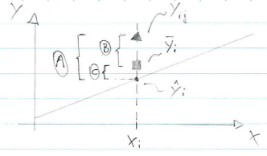

```{r setup, include=FALSE}
library(knitr, quietly = TRUE)
library(lattice, quietly = TRUE)
opts_chunk$set(
               cache = TRUE,
               tidy = FALSE,
               comment = "#",
               collapse = TRUE,
               fig.align = "center",
               fig.path = "figures/",
               cache.path = "cache/"
           )
```


```{r external-code, cache=FALSE, include=FALSE}
knitr::read_chunk("scripts/fatorial_pontos-centrais_respostas.R")
```

# Introdução

Nos experimentos $2^k$, pelo fato de usarmos apenas 2 níveis de cada
fator, estamos automaticamente assumindo que a relação de dependência da
resposta para os fatores é linear. Existe então uma preocupação sobre
essa suposição de linearidade.

Podemos notar que, ao se adicionar um **termo de interação** à um modelo
de efeitos principais de **primeira ordem**, resultando em

(@1ord) $$
y = \beta_0 + \sum_{j=1}^{k} \beta_{j} x_j +
	\mathop{\sum\sum}\limits_{i < j} \beta_{ij} x_i x_j +
	\epsilon
$$

então temos um modelo capaz de representar uma curvatura na variável
resposta. Essa curvatura é resultado da "torção" no plano induzida pelos
termos da interação $\beta_{ij} x_i x_j$.

No entanto, podem existir situações onde a curvatura na variável
resposta não é modelada adequadamente pela equação (@1ord) acima. Nestes
casos, devemos considerar um modelo com

(@2ord) $$
y = \beta_0 + \sum_{j=1}^{k} \beta_{j} x_j +
	\mathop{\sum\sum}\limits_{i < j} \beta_{ij} x_i x_j +
	\sum_{j=1}^{k} \beta_{jj} x_{j}^{2} +
	\epsilon
$$

onde $\beta_{jj}$ representa **efeitos quadráticos** ou de **segunda
ordem**. Este modelo também é chamado de **superfície de resposta de
segunda ordem**.

Uma forma de testar se existe curvatura ("proteção contra curvatura") é
através da **adição de pontos centrais** ao planejamento $2^k$. Como o
próprio nome sugere, esses pontos serão os valores (0, 0) na escala
codificada dos níveis (-1, 1). Portanto, o processo consiste em realizar
$n_c$ réplicas no ponto $x_i = 0$, ($i = 1, 2, \ldots, k$). Uma razão
importante para adicionar as corridas replicadas no centro do
planejamento, é que pontos centrais não interferem nas estimativas dos
efeitos de planejamentos $2^k$. Quando adicionamos os pontos centrais,
consideramos que os $k$ fatores são quantitativos.

Para ilustrar a abordagem, considere um experimento $2^2$ com uma
observação em cada um dos pontos fatoriais: (-,-), (+,-), (-,+), (+,+),
e $n_c$ observações nos pontos centrais (0,0). Seja $\bar{y}_F$ a média
das quatro corridas nos quatro pontos fatoriais, e $\bar{y}_C$ a média
das $n_C$ corridas no ponto central. Se a diferença $\bar{y}_F -
\bar{y}_C$ for pequena, os pontos centrais estarão no plano ou próximo
do plano passando através dos pontos fatoriais, não havendo portanto
curvatura. Por outro lado, se $\bar{y}_F - \bar{y}_C$ for grande, então
há indícios de que existe curvatura. A **soma de quadrados da
curvatura**, com **um grau de liberdade** é dada por

(@sqcurv) $$
\begin{align}
SQ_{curv} &= \left( \frac{\bar{y}_F - \bar{y}_C}{\sqrt{\frac{1}{n_F} +
\frac{1}{n_C}}} \right)^2 \\
              \\
&= \frac{n_F n_C (\bar{y}_F - \bar{y}_C)^2}{n_F + n_C}
\end{align}
$$

onde $n_F$ é o número de pontos do planejamento fatorial. Essa soma de
quadrados deve ser comparada com a média quadrática do erro (como existe
um grau de liberdade, então $SQ_{curv} = MQ_{curv}$) para testar a
curvatura. Note que quando a equação (@sqcurv) acima for dividida por
$\hat{\sigma}^2 = MQ_{Res}$, o resultado será similar ao quadrado da
estatística $t$ usada para comparar duas médias, o que equivale a um
teste F.

Mais especificamente, quando pontos centrais são adicionados à um
experimento $2^k$, então o teste para curvatura (usando a equação acima)
realmente testa as hipóteses

$$
\begin{align}
\text{H}_0 &: \sum_{j=1}^{k} \beta_{jj} = 0 \\
\text{H}_1 &: \sum_{j=1}^{k} \beta_{jj} \neq 0
\end{align}
$$

Além disso, se os pontos fatoriais do planejamento não forem replicados,
poderemos usar os $n_C$ pontos centrais para construir uma **estimativa de
erro** com $n_C - 1$ graus de liberdade (chamado de "erro puro").

Com a adição de pontos centrais é possível ter uma estimativa de erro
(variância) pura, ou seja, que independe do modelo especificado. A idéia
básica é **decompor a soma de quadrados dos resíduos** em soma de
quadrado **pura** e soma de quadrados devido à **falta de ajuste**.

O teste da falta de ajuste é importante para situar-se na região
experimental. No caso de não haver falta de ajuste entende-se que o
modelo de primeira ordem (@1ord) que estima efeitos principais e
interações apenas, é adequado para descrever o fenômeno. Por outro lado,
a existência de falta de ajuste indica que para pelo menos um dos $k$
fatores existe uma relação não linear e que este fator está perto da sua
região experimental ótima (isso será melhor explorado na metodologia de
superfície de resposta).

Quando isso acontecer, os próximos experimentos devem ser planejados de
forma a pertimitir estimação de termos quadráticos para capturar essa
não linearidade da relação $y \sim x_1 + x_2 + \cdots + x_k$ bem como
permitir encontrar pontos de ótimo da relação, que é o nosso objetivo
principal.

# Sobre a falta de ajuste em modelos lineares

De maneira geral, para verificar se o modelo linear é adequado para
descrever a relação entre $X$ e $Y$, devemos realizar um teste para
**falta de ajuste**.

A falta de ajuste pode ser verificada quando existem medições repetidas
de $Y$ para um certo nível de $X$. Por exemplo, se $X_i$ for considerada
em uma escala discreta com $k$ níveis ($i = 1, 2, \ldots, k$), podemos
observar $n_i$ repetições de $Y_{ij}$ ($j = 1, 2, \ldots, n_i$).

No caso específico de um experimento fatorial $2^2$, por exemplo, temos
o fator $A$ com 2 níveis, $B$ com 2 níveis, onde cada nível ($-1$ e $1$)
são os pontos na escala discreta. Considere que não há repetições, então
existem apenas quatro observações deste experimento fatorial. Com a
adição de um ponto central ($0,0$), geralmente temos $n_C$ repetições,
que seriam as medidas repetidas para este ponto.

Quando existem repetições, é possível calcular o **erro puro**, ou seja,
o desvio de cada observação $Y_{ij}$, com relação à média do nível $i$,
$\bar{y}_i$.

Novamente fazendo associação com um experimento fatorial com ponto
central, nós podemos usar as medidas repetidas do ponto central para
estimar o erro experimental. Note que esta é uma **grande vantagem** da
adição de pontos centrais, pois mesmo em experimentos fatorias onde não
há repetições para os pontos dos fatores, se houver medidas repetidas
apenas no ponto central, podemos ter uma estimativa do erro.

Note que **o erro puro não depende de nenhum modelo**, pois mede apenas os
desvios das observações em relação à média. Por esse motivo, ele pode
ser comparado com os desvios de um modelo de regressão para verificação
da qualidade do ajuste. A ideia é que se o modelo linear é adequado,
então os desvios das observações em relação à média (erro puro) devem
ser próximos dos desvios das observações em relação ao modelo ajustado.

Se não houverem repetições nos níveis de $X_i$ (ou no ponto central),
então a suposição de linearidade deve ser verificada
através dos resíduos do modelo apenas. (Mesmo com a realização de um
teste de falta de ajuste, os resíduos sempre devem ser verificados).

Para representar o erro puro e a falta de ajuste, podemos realizar a
decomposição da soma de quadrados dos resíduos, quando existem
repetições para $X_i$, em

```{r, echo=FALSE, out.width='60%'}

```

$$
\begin{align}
A &= B + C \\
(y_{ij} - \hat{y}_i) &= (y_{ij} - \bar{y}_i) + (\bar{y}_i - \hat{y}_i) \\
\text{Resíduo} &= \text{Erro puro} + \text{Desvio de regressão (falta de
ajuste)}
\end{align}
$$

Fazendo a soma de quadrados destes termos, temos

$$
\begin{align}
\sum_{i=1}^{k}\sum_{j=1}^{n_i} (y_{ij} - \hat{y}_i)^2 &=
	\sum_{i=1}^{k}\sum_{j=1}^{n_i} (y_{ij} - \bar{y}_i)^2 +
	\sum_{i=1}^{k}\sum_{j=1}^{n_i} (\bar{y}_i - \hat{y}_i)^2 \\
 &=
	\sum_{i=1}^{k}\sum_{j=1}^{n_i} (y_{ij} - \bar{y}_i)^2 +
	\sum_{i=1}^{k} n_i (\bar{y}_i - \hat{y}_i)^2
\end{align}
$$

Com isso, podemos ver que um modelo "bom" (onde a suposição de
linearidade é adequada), será aquele em que a falta de ajuste (ou desvio
de regressão), será próxima de zero, pois em um modelo correto,
esperamos que

$$
\hat{y}_i = \bar{y}_i
$$

Com isso, se o modelo for correto, então $QMRes$ provê uma estimativa
não viesada para $\sigma^2$. Se o modelo for incorreto, então $QMRes$
será uma estimativa viesada para $\sigma^2$, pois haverá um desvio
sistemático (viés) entre o modelo correto (desconhecido), e o modelo
incorreto utilizado:

$$
\sigma^2 + \text{B}_i
$$

onde

$$
\text{B}_i = \text{E}(Y_i) - \text{E}(\hat{Y}_i)
$$

é o viés. Usar o modelo incorreto, levará, portanto, à estimativas
viciadas das variâncias dos estimadores, e por consequência, os
intervalos de confiança e os testes de hipótese serão incorretos.

Faz sentido então, testarmos as hipóteses

$$
\begin{align}
\text{H}_0 &: \text{o modelo é adequado (não há falta de ajuste)} \\
\text{H}_1 &: \text{o modelo não é adequado (há falta de ajuste)}
\end{align}
$$

com base na $SQep$ (soma de quadrados do erro puro) e $SQlof$ (soma de
quadrados da falta de ajuste). Como já vimos, a $SQep$ é calculada como

$$
SQep = \sum_{i=1}^{k}\sum_{j=1}^{n_i} (y_{ij} - \bar{y}_i)^2
$$

com $(n-k)$ graus de liberdade, pois são necessárias $k$ médias para o
cálculo. No caso do experimento fatorial $2^2$ com $n_C$ pontos
centrais, esta soma de quadrados é

$$
SQep = \sum_{i=1}^{n_C} (y_{i} - \bar{y}_C)^2
$$

onde $\bar{y}_C$ é a média dos pontos centrais. Como aqui só há uma
média, então existem $n_C - 1$ graus de liberdade.

Como vimos na equação (@sqcurv) acima, a soma de quadrados da curvatura,
ou da falta de ajuste, é

$$
SQ_{curv} = \frac{n_F n_C (\bar{y}_F - \bar{y}_C)^2}{n_F + n_C}
$$

com um grau de liberdade. Com isso, a hipótese pode ser testada com

$$
\frac{SQcurv/1}{SQep/(n_C - 1)} = \frac{MQcurv}{MQep}
$$

que, sob $H_0$, possui distribuição $F$ com $1$, e $n_C - 1$ graus de
liberdade.

# Exemplos

## Fatorial $2^2$ + 5 pontos centrais

```{r mont146}
##----------------------------------------------------------------------
## Importação e definições
url <- "http://www.leg.ufpr.br/~fernandomayer/data/montgomery_14-6.csv"
dados <- read.csv(url)
str(dados)
## Definições
k <- 2
a <- b <- 2
r <- 1
n <- r*2^k

##----------------------------------------------------------------------
## Análise exploratória
with(subset(dados, Tempo != 0),
     interaction.plot(Tempo, Temperatura, Rendimento))
with(subset(dados, Tempo == 0),
            points(x = 1.5, y = mean(Rendimento), pch = 16, col = 2))
wireframe(Rendimento ~ Tempo + Temperatura, data = dados, drape = TRUE)

##----------------------------------------------------------------------
## Montando a tabela de sinais
tab <- model.matrix(~ Tempo * Temperatura, data = dados)
tab

##----------------------------------------------------------------------
## Cálculo dos contrastes e efeitos
## Contrastes
(contr <- t(tab[, -1]) %*% dados$Rendimento)
## Efeitos
(ef <- contr/(r*2^(k-1)))
```

Note que os pontos centrais, por serem definidos no ponto (0,0) não são
considerados efeitos, e por isso não são estimados.

O teste manual para falta de ajuste pode ser feito da seguinte forma:

```{r}
## Separa os pontos fatoriais dos centrais e calcula tamanho das
## amostras
yf <- dados$Rendimento[dados$Tempo != 0] # y dos pontos fatoriais
yc <- dados$Rendimento[dados$Tempo == 0] # y do ponto central (0,0)
(nf <- length(yf))
(nc <- length(yc))
## Médias
c(mean(yf), mean(yc))
diff(c(mean(yf), mean(yc)))
```

A SQ do erro puro mede a distância das observações do ponto central em
relação à sua média

```{r}
(SQpuro <- sum((yc - mean(yc))^2))
```

Como só existe uma média, então essa SQ está associada à $n_c - 1$ graus
de liberdade. Dessa forma, podemos obter uma estimativa do "erro puro",
ou seja, independente do modelo adotado

```{r}
(MQpuro <- SQpuro/(nc-1))
```

Agora podemos calcular a SQ devido à curvatura, ou à falta de ajuste,
conforme mostrado anteriormente

```{r}
## lof = lack of fit
(SQlof <- (nf * nc * (mean(yc) - mean(yf))^2)/(nf + nc))
```

que possui apneas um grau de liberdade (portanto SQlof = MQlof).
Como vimos, o teste F para a falta de ajuste vem da razão entre MQlof
e MQpuro

```{r}
(Flof <- SQlof/MQpuro)
## Calculando o p-valor associado, temos
pf(Flof, 1, nc - 1, lower.tail = FALSE)
```

Ou seja, não rejeitamos a hipótese de que o modelo linear é adequado (ou
de que não existe falta de ajuste).

Fazendo através das funções do R, podemos adotar a seguinte abordagem:

```{r}
## Modelo desconsiderando os pontos centrais
m0 <- lm(Rendimento ~ Tempo * Temperatura, data = dados,
         subset = Tempo != 0)
anova(m0)
```

Note que dessa forma não temos uma estimativa do erro.

```{r}
## Modelo considerando os pontos centrais
m1 <- lm(Rendimento ~ Tempo * Temperatura, data = dados)
anova(m1)
```

Mesmo sem repetição dos fatores, obtemos uma estimativa do erro devido
às repetições do ponto central. Mas note que essa estimativa pode ser
viesada pois não consideramos um termo quadrático no modelo para
incorporar a falta de ajuste. Caso não exista falta de ajuste, ou seja o
modelo linear é adequado, então esta estimativa está correta (não
viesada). Mas se o modelo linear não for adequado a estimativa será
viesada. Para incluir um termo que define a falta de ajuste podemos
criar uma nova variável indicadora para os pontos fatoriais e os pontos
centrais. Obtemos esse termo elevendo qualquer coluna de fator ao
quadrado:

```{r}
dados$lof <- dados$Tempo^2
```
lof aqui significa "lack of fit". Note que essa coluna somente indica
 quais observações são dos eixos fatoriais e quais são do ponto
 central

```{r}
dados
```

Isso irá fazer com que a média do plano fatorial (\bar{y}_f) seja
contrastada com a média do plano dos pontos centrais (\bar{y}_c).
Agora podemos ajustar um novo modelo com esse termo

```{r}
m2 <- lm(Rendimento ~ Tempo * Temperatura + lof, data = dados)
anova(m2)
```

O ideal é que a SQlof seja a última linha do quadro de ANOVA, porém,
como nesses modelos existe ortogonalidade entre os efeitos, isso deixa
de ter importância. Note que o teste F para SQlof está de fato testando
se esse termo é importante, ou em outras palavras, se a diferença entre
as médias dos eixos dos fatores é significativa. Um TRV entre os modelos
com e sem lof mostra o mesmo resultado.

```{r}
anova(m2, m1)
```

Nesse caso, não rejeitamos a hipótese de que essas médias são iguas e
concluimos que não há falta de ajuste, e que o modelo linear é adequado.
Assim, podemos redefinir o modelo sem esse termo

```{r}
mf <- update(m2, . ~ . -lof)
anova(mf)
```

Como a interação também é não significativa, então também a retiramos do
modelo

```{r}
mf <- update(mf, . ~ . -Tempo:Temperatura)
anova(mf)
```

Dessa forma temos uma estimativa de erro não viesada e um modelo
parcimonioso para descrever o processo.

Podemos então avaliar os resíduos e fazer as predições:

```{r}
##----------------------------------------------------------------------
## Residuos do modelo
res <- residuals(mf)
## Quantis normais
qqnorm(res); qqline(res)
## Resíduo vs preditor
par(mfrow = c(1, 2))
with(dados, {
    plot(res ~ Tempo)
    abline(h = 0, lty = 2, col = 2)
    plot(res ~ Temperatura)
    abline(h = 0, lty = 2, col = 2)
})
par(mfrow = c(1, 1))

##----------------------------------------------------------------------
## Predições

## Predição para as combinações únicas dos fatores
pred <- data.frame(Tempo = dados$Tempo,
                   Temperatura = dados$Temperatura)
pred$y <- predict(mf, newdata = pred)
pred
## Verifica a projeção
proj(mf)
cbind(pred, yproj = apply(proj(mf)[,-4], 1, sum))

## Predição para um intervalo de valores entre os níveis baixo e alto
## dos fatores
pred <- expand.grid(Tempo = seq(-1, 1, length.out = 30),
                    Temperatura = seq(-1, 1 ,length.out = 30))
pred$y <- predict(mf, newdata = pred)
## Vários formas de visualizar
wireframe(y ~ Tempo + Temperatura, data = pred, drape = TRUE)
levelplot(y ~ Tempo + Temperatura, data = pred, cuts = 90,
          col.regions = heat.colors)
```

## Fatorial $2^5$ + 5 pontos centrais

Um experimento foi realizado em uma planta de fabricação de
semicondutores, como um esforço para aumentar o rendimento. Cinco
fatores, cada um com dois níveis, foram estudados. Os fatores (e níveis)
foram A = abertura (peq, grande), B = tempo de exposição (20% abaixo,
20% acima do valor nominal), C = tempo de desenvolvimento (30, 40 s), D
= dimensão da máscara (peq, grande), e E = tempo de ataque químico
(14.5, 15.5 min). Foi realizado um planejamento 2^5 + 5 pontos centrais.
Com isso:

a. Construa um gráfico de probabilidade normal dos efeitos estimados.
Que efeitos parecem ser grandes?
b. Conduza a análise de variância para confirmar suas descobertas do
item (a).
c. Estime o erro experimental usando os pontos centrais e conduza a
análise de variância para testar a falta de ajuste.
d. Avalie os pressupostos por meio de análise gráfica dos resíduos.
e. Projete o planejamento $2^5$ deste problema em um planejamento $2^k$,
$k<5$, nos fatores importantes.


```{r mont1417}
##----------------------------------------------------------------------
## Dados e definições
url <- "http://www.leg.ufpr.br/~fernandomayer/data/montgomery_14-17.txt"
da <- read.csv(url, sep = "\t")
str(da)
r <- 1
k <- 5

##----------------------------------------------------------------------
## a) Gráfico q-q dos efeitos
tab <- model.matrix(~ A * B * C * D * E, data = da)
contr <- t(tab[, -1]) %*% da$Y
(ef <- contr/(r * 2^(k-1)))
aux <- qqnorm(ef, col = 2, pch = 19); qqline(ef)
text(aux$x, aux$y, rownames(aux$y), cex = 0.8, pos = 3)

##----------------------------------------------------------------------
## b) Análise de variância para confirmar impressões de (a)
m0 <- lm(Y ~ (A + B + C + D + E)^2, data = da)
anova(m0)

##----------------------------------------------------------------------
## c) Avaliar se existe falta de ajuste

## Separa os pontos fatoriais dos centrais e calcula tamanho das
## amostras
yf <- da$Y[da$A != 0] # y dos pontos fatoriais
yc <- da$Y[da$A == 0] # y do ponto central (0,0)
(nf <- length(yf))
(nc <- length(yc))
## Médias
c(mean(yf), mean(yc))
diff(c(mean(yf), mean(yc)))
## Erro experimental usando pontos centrais
(SQpuro <- sum((yc - mean(yc))^2))
(MQpuro <- SQpuro/(nc-1))

## Teste para falta de ajuste
da$lof <- da$A^2
m1 <- lm(Y ~ (A + B + C + D + E)^2 + lof, data = da)
anova(m1)
anova(m0, m1)

##----------------------------------------------------------------------
## d) Avaliação dos pressupostos
## Para o modelo sem lof
res.m0 <- residuals(m0)
qqnorm(res.m0); qqline(res.m0)

## Para o modelo com lof
res.m1 <- residuals(m1)
qqnorm(res.m1); qqline(res.m1)

##----------------------------------------------------------------------
## e) Projeção do experimento
## Os fatores D e E podem ser desconsiderados nos próximos ensaios. Então reduz-se o estudo
## à 3 fatores.
## Modelo final, mantendo apenas fatores importantes
mf <- lm(Y ~ A + B + C + A:B + lof, data = da)
anova(mf)
```

Note que o experimento foi reduzido para um fatorial $2^3$. Devido a
existência de falta de ajuste, o planejamento dos próximos experimentos
deve permitir estimar efeitos quadráticos. Pode-se usar, por exemplo,
experimentos fatoriais com pontos centrais e axiais (metodologia de
superfície de resposta).

Note também que a inclusão da coluna `lof` não significa que estamos
ajustando um modelo com termos quadráticos (de segunda ordem). Essa
coluna serve apenas para indicar um contraste entre duas médias (dos
pontos fatoriais e centrais) e testar se existe falta de ajuste. Caso a
falta de ajuste exista, então devemos **planejar** o próximo experimento
de forma que seja possível estimar termos quadráticos.

# Exercícios

1. (Montgomery, EAPE, ex. 14-23) Considere um experimento
fatorial $2^2$ com 4 pontos centrais. Os dados estão disponíveis
[aqui](http://leg.ufpr.br/~fernandomayer/data/montgomery_ex_14-23.txt).
Calcule uma ANOVA com a soma de quadrados para a curvatura, faça a
seleção do modelo e verifique se existe falta de ajuste.
```{r ex1, eval=FALSE, include=FALSE}
```
2. (Montgomery, ICEQ, exemplo 13.9) Um artigo em *Solid State
   Technology* descreve a aplicação de planejamentos fatoriais no
   desenvolvimento de um processo de gravação por nitreto em um gravador
   de plasma de placa única. O processo usa $C_2F_6$ como o gás
   reagente. Os autores usaram uma única replicação de um planejamento
   $2^4$ para estudar esse processo. Os fatores testados foram:
   espaçamento (A-: 0.8, A+: 1.2), pressão (B-: 450, B+: 550), fluxo de
   $C_2F_6 (C-: 125, C+: 200)$, potência (D-: 275, D+: 325). Foram
   também adicionados 4 pontos centrais. Os dados estão disponíveis
   [aqui](http://leg.ufpr.br/~fernandomayer/data/montgomery_ICEQ_ex_13.9.csv).
   Faça a ANOVA, avalie o modelo e verifique se existe falta de ajuste.
```{r ex2, eval=FALSE, include=FALSE}
```

As respostas podem ser consultadas neste
[script](scripts/fatorial_pontos-centrais_respostas.R).
